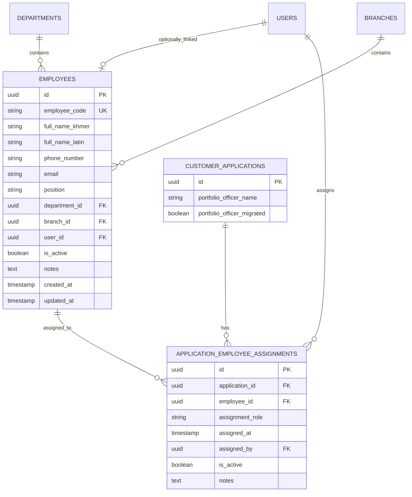

# Design Document

## Overview

The Employee Assignment System introduces a new `Employee` entity separate from system `User` accounts, enabling tracking of staff members who work on applications without requiring system login credentials. This design maintains backward compatibility with the existing `portfolio_officer_name` field while providing structured, reportable employee data.

**Key Design Principles:**
- Separation of concerns: Employees (work on applications) vs Users (system access)
- Backward compatibility with existing free-text fields
- Flexible assignment model supporting multiple employees per application
- Optional linking between Employee and User records
- Comprehensive audit trail for all assignments

## Architecture

### High-Level Architecture

```
┌─────────────────────────────────────────────────────────────┐
│                     Frontend Layer                           │
│  ┌──────────────┐  ┌──────────────┐  ┌──────────────┐      │
│  │ Employee     │  │ Application  │  │ Employee     │      │
│  │ Management   │  │ Form with    │  │ Reports      │      │
│  │ UI           │  │ Assignment   │  │ Dashboard    │      │
│  └──────────────┘  └──────────────┘  └──────────────┘      │
└─────────────────────────────────────────────────────────────┘
                           │
                           ▼
┌─────────────────────────────────────────────────────────────┐
│                      API Layer                               │
│  ┌──────────────┐  ┌──────────────┐  ┌──────────────┐      │
│  │ /employees   │  │ /applications│  │ /employee-   │      │
│  │ CRUD         │  │ with         │  │ assignments  │      │
│  │ endpoints    │  │ assignments  │  │ endpoints    │      │
│  └──────────────┘  └──────────────┘  └──────────────┘      │
└─────────────────────────────────────────────────────────────┘
                           │
                           ▼
┌─────────────────────────────────────────────────────────────┐
│                    Service Layer                             │
│  ┌──────────────┐  ┌──────────────┐  ┌──────────────┐      │
│  │ Employee     │  │ Assignment   │  │ Migration    │      │
│  │ Service      │  │ Service      │  │ Service      │      │
│  └──────────────┘  └──────────────┘  └──────────────┘      │
└─────────────────────────────────────────────────────────────┘
                           │
                           ▼
┌─────────────────────────────────────────────────────────────┐
│                    Data Layer                                │
│  ┌──────────────┐  ┌──────────────┐  ┌──────────────┐      │
│  │ Employee     │  │ Application  │  │ Employee     │      │
│  │ Model        │  │ Assignment   │  │ Assignment   │      │
│  │              │  │ Model        │  │ Model        │      │
│  └──────────────┘  └──────────────┘  └──────────────┘      │
└─────────────────────────────────────────────────────────────┘
```

### Database Schema Design

#### New Tables

**1. employees**
```sql
CREATE TABLE employees (
    id UUID PRIMARY KEY DEFAULT uuid_generate_v4(),
    employee_code VARCHAR(20) UNIQUE NOT NULL,
    full_name_khmer VARCHAR(255) NOT NULL,
    full_name_latin VARCHAR(255) NOT NULL,
    phone_number VARCHAR(20) NOT NULL,
    email VARCHAR(255),
    position VARCHAR(100),
    department_id UUID REFERENCES departments(id),
    branch_id UUID REFERENCES branches(id),
    user_id UUID REFERENCES users(id),  -- Optional link to system user
    is_active BOOLEAN DEFAULT TRUE,
    notes TEXT,
    created_at TIMESTAMP WITH TIME ZONE DEFAULT NOW(),
    updated_at TIMESTAMP WITH TIME ZONE DEFAULT NOW(),
    created_by UUID REFERENCES users(id),
    updated_by UUID REFERENCES users(id),
    
    -- Indexes
    INDEX idx_employees_code (employee_code),
    INDEX idx_employees_department (department_id),
    INDEX idx_employees_branch (branch_id),
    INDEX idx_employees_active (is_active),
    INDEX idx_employees_user_link (user_id)
);
```

**2. application_employee_assignments**
```sql
CREATE TABLE application_employee_assignments (
    id UUID PRIMARY KEY DEFAULT uuid_generate_v4(),
    application_id UUID NOT NULL REFERENCES customer_applications(id) ON DELETE CASCADE,
    employee_id UUID NOT NULL REFERENCES employees(id),
    assignment_role VARCHAR(50) NOT NULL,  -- 'primary_officer', 'secondary_officer', 'field_officer', etc.
    assigned_at TIMESTAMP WITH TIME ZONE DEFAULT NOW(),
    assigned_by UUID REFERENCES users(id),
    is_active BOOLEAN DEFAULT TRUE,
    notes TEXT,
    
    -- Composite unique constraint to prevent duplicate assignments
    UNIQUE(application_id, employee_id, assignment_role),
    
    -- Indexes
    INDEX idx_assignments_application (application_id),
    INDEX idx_assignments_employee (employee_id),
    INDEX idx_assignments_role (assignment_role),
    INDEX idx_assignments_active (is_active)
);
```

#### Modified Tables

**customer_applications** - Add migration support field:
```sql
ALTER TABLE customer_applications 
ADD COLUMN portfolio_officer_migrated BOOLEAN DEFAULT FALSE;
-- Keeps track of whether portfolio_officer_name has been migrated to employee assignment
```

### Entity Relationship Diagram



## Components and Interfaces

### Backend Components

#### 1. Employee Model (`le-backend/app/models.py`)

```python
class Employee(Base):
    __tablename__ = "employees"
    
    id = Column(UUID(as_uuid=True), primary_key=True, default=uuid.uuid4)
    employee_code = Column(String(20), unique=True, nullable=False, index=True)
    full_name_khmer = Column(String(255), nullable=False)
    full_name_latin = Column(String(255), nullable=False)
    phone_number = Column(String(20), nullable=False)
    email = Column(String(255), nullable=True)
    position = Column(String(100), nullable=True)
    department_id = Column(UUID(as_uuid=True), ForeignKey('departments.id'), nullable=True)
    branch_id = Column(UUID(as_uuid=True), ForeignKey('branches.id'), nullable=True)
    user_id = Column(UUID(as_uuid=True), ForeignKey('users.id'), nullable=True, unique=True)
    is_active = Column(Boolean, default=True, index=True)
    notes = Column(Text, nullable=True)
    created_at = Column(DateTime(timezone=True), server_default=func.now())
    updated_at = Column(DateTime(timezone=True), server_default=func.now(), onupdate=func.now())
    created_by = Column(UUID(as_uuid=True), ForeignKey('users.id'), nullable=True)
    updated_by = Column(UUID(as_uuid=True), ForeignKey('users.id'), nullable=True)
    
    # Relationships
    department = relationship("Department", foreign_keys=[department_id])
    branch = relationship("Branch", foreign_keys=[branch_id])
    linked_user = relationship("User", foreign_keys=[user_id])
    creator = relationship("User", foreign_keys=[created_by])
    updater = relationship("User", foreign_keys=[updated_by])
    assignments = relationship("ApplicationEmployeeAssignment", back_populates="employee")


class ApplicationEmployeeAssignment(Base):
    __tablename__ = "application_employee_assignments"
    
    id = Column(UUID(as_uuid=True), primary_key=True, default=uuid.uuid4)
    application_id = Column(UUID(as_uuid=True), ForeignKey('customer_applications.id', ondelete='CASCADE'), nullable=False, index=True)
    employee_id = Column(UUID(as_uuid=True), ForeignKey('employees.id'), nullable=False, index=True)
    assignment_role = Column(String(50), nullable=False, index=True)
    assigned_at = Column(DateTime(timezone=True), server_default=func.now())
    assigned_by = Column(UUID(as_uuid=True), ForeignKey('users.id'), nullable=True)
    is_active = Column(Boolean, default=True, index=True)
    notes = Column(Text, nullable=True)
    
    # Relationships
    application = relationship("CustomerApplication", back_populates="employee_assignments")
    employee = relationship("Employee", back_populates="assignments")
    assigner = relationship("User", foreign_keys=[assigned_by])
    
    # Unique constraint
    __table_args__ = (
        Index('idx_unique_assignment', 'application_id', 'employee_id', 'assignment_role', unique=True),
    )
```

#### 2. Pydantic Schemas (`le-backend/app/schemas.py`)

```python
# Employee Schemas
class EmployeeBase(BaseSchema):
    employee_code: str = Field(..., min_length=1, max_length=20)
    full_name_khmer: str = Field(..., min_length=1, max_length=255)
    full_name_latin: str = Field(..., min_length=1, max_length=255)
    phone_number: str = Field(..., min_length=1, max_length=20)
    email: Optional[EmailStr] = None
    position: Optional[str] = Field(None, max_length=100)
    department_id: Optional[UUID] = None
    branch_id: Optional[UUID] = None
    user_id: Optional[UUID] = None
    is_active: bool = True
    notes: Optional[str] = None

class EmployeeCreate(EmployeeBase):
    pass

class EmployeeUpdate(BaseSchema):
    employee_code: Optional[str] = Field(None, min_length=1, max_length=20)
    full_name_khmer: Optional[str] = Field(None, min_length=1, max_length=255)
    full_name_latin: Optional[str] = Field(None, min_length=1, max_length=255)
    phone_number: Optional[str] = Field(None, min_length=1, max_length=20)
    email: Optional[EmailStr] = None
    position: Optional[str] = Field(None, max_length=100)
    department_id: Optional[UUID] = None
    branch_id: Optional[UUID] = None
    user_id: Optional[UUID] = None
    is_active: Optional[bool] = None
    notes: Optional[str] = None

class EmployeeResponse(EmployeeBase):
    id: UUID
    created_at: datetime
    updated_at: datetime
    department: Optional[DepartmentResponse] = None
    branch: Optional[BranchResponse] = None
    linked_user: Optional[UserSummary] = None
    assignment_count: int = 0

# Assignment Schemas
class AssignmentRole(str, Enum):
    PRIMARY_OFFICER = "primary_officer"
    SECONDARY_OFFICER = "secondary_officer"
    FIELD_OFFICER = "field_officer"
    REVIEWER = "reviewer"
    APPROVER = "approver"

class EmployeeAssignmentBase(BaseSchema):
    employee_id: UUID
    assignment_role: AssignmentRole
    notes: Optional[str] = None

class EmployeeAssignmentCreate(EmployeeAssignmentBase):
    pass

class EmployeeAssignmentUpdate(BaseSchema):
    assignment_role: Optional[AssignmentRole] = None
    is_active: Optional[bool] = None
    notes: Optional[str] = None

class EmployeeAssignmentResponse(EmployeeAssignmentBase):
    id: UUID
    application_id: UUID
    assigned_at: datetime
    assigned_by: Optional[UUID] = None
    is_active: bool
    employee: EmployeeResponse

# Enhanced Application Response with Assignments
class CustomerApplicationResponseWithAssignments(CustomerApplicationResponse):
    employee_assignments: List[EmployeeAssignmentResponse] = []
    portfolio_officer_migrated: bool = False
```

#### 3. API Router (`le-backend/app/routers/employees.py`)

```python
from fastapi import APIRouter, Depends, HTTPException, Query, status
from sqlalchemy.ext.asyncio import AsyncSession
from typing import List, Optional
from uuid import UUID

router = APIRouter(prefix="/employees", tags=["employees"])

# Employee CRUD endpoints
@router.post("/", response_model=schemas.EmployeeResponse, status_code=status.HTTP_201_CREATED)
async def create_employee(...)

@router.get("/", response_model=schemas.PaginatedResponse)
async def list_employees(
    page: int = Query(1, ge=1),
    size: int = Query(10, ge=1, le=100),
    search: Optional[str] = None,
    department_id: Optional[UUID] = None,
    branch_id: Optional[UUID] = None,
    is_active: Optional[bool] = None,
    ...)

@router.get("/{employee_id}", response_model=schemas.EmployeeResponse)
async def get_employee(employee_id: UUID, ...)

@router.patch("/{employee_id}", response_model=schemas.EmployeeResponse)
async def update_employee(employee_id: UUID, ...)

@router.delete("/{employee_id}", status_code=status.HTTP_204_NO_CONTENT)
async def delete_employee(employee_id: UUID, ...)

# Assignment endpoints
@router.post("/assignments", response_model=schemas.EmployeeAssignmentResponse)
async def assign_employee_to_application(...)

@router.get("/assignments/application/{application_id}", response_model=List[schemas.EmployeeAssignmentResponse])
async def get_application_assignments(application_id: UUID, ...)

@router.get("/assignments/employee/{employee_id}", response_model=List[schemas.EmployeeAssignmentResponse])
async def get_employee_assignments(employee_id: UUID, ...)

@router.delete("/assignments/{assignment_id}", status_code=status.HTTP_204_NO_CONTENT)
async def remove_assignment(assignment_id: UUID, ...)

# Reporting endpoints
@router.get("/{employee_id}/workload", response_model=schemas.EmployeeWorkloadResponse)
async def get_employee_workload(employee_id: UUID, ...)

@router.get("/reports/workload-summary", response_model=List[schemas.EmployeeWorkloadSummary])
async def get_workload_summary(...)
```

#### 4. Service Layer (`le-backend/app/services/employee_service.py`)

```python
class EmployeeService:
    """Service for employee management operations"""
    
    @staticmethod
    async def create_employee(db: AsyncSession, employee_data: EmployeeCreate, created_by: UUID) -> Employee:
        """Create a new employee with validation"""
        
    @staticmethod
    async def get_employee_by_code(db: AsyncSession, employee_code: str) -> Optional[Employee]:
        """Get employee by employee code"""
        
    @staticmethod
    async def search_employees(db: AsyncSession, search_term: str, is_active: bool = True) -> List[Employee]:
        """Search employees by name or code"""
        
    @staticmethod
    async def link_employee_to_user(db: AsyncSession, employee_id: UUID, user_id: UUID) -> Employee:
        """Link an employee record to a system user"""
        
    @staticmethod
    async def get_employee_workload(db: AsyncSession, employee_id: UUID, status_filter: Optional[str] = None) -> Dict:
        """Get workload statistics for an employee"""


class EmployeeAssignmentService:
    """Service for managing employee assignments to applications"""
    
    @staticmethod
    async def assign_employee(
        db: AsyncSession,
        application_id: UUID,
        employee_id: UUID,
        role: AssignmentRole,
        assigned_by: UUID,
        notes: Optional[str] = None
    ) -> ApplicationEmployeeAssignment:
        """
        Assign an employee to an application
        
        Validates:
        - Employee exists and is active
        - Employee belongs to the same branch as the application
        - No duplicate assignment exists
        """
        
    @staticmethod
    async def get_application_assignments(
        db: AsyncSession,
        application_id: UUID,
        active_only: bool = True
    ) -> List[ApplicationEmployeeAssignment]:
        """Get all employee assignments for an application"""
        
    @staticmethod
    async def remove_assignment(
        db: AsyncSession,
        assignment_id: UUID
    ) -> None:
        """Remove an employee assignment"""
        
    @staticmethod
    async def migrate_portfolio_officer_name(
        db: AsyncSession,
        application_id: UUID,
        migrated_by: UUID
    ) -> Optional[ApplicationEmployeeAssignment]:
        """Migrate free-text portfolio_officer_name to employee assignment"""
```

### Frontend Components

#### 1. Employee Management Page (`lc-workflow-frontend/app/employees/page.tsx`)

- List view with search, filter, and pagination
- Create/Edit employee modal
- Deactivate/Activate employee actions
- Link to user account functionality

#### 2. Employee Selector Component (`lc-workflow-frontend/src/components/employees/EmployeeSelector.tsx`)

```typescript
interface EmployeeSelectorProps {
  value: EmployeeAssignment[];
  onChange: (assignments: EmployeeAssignment[]) => void;
  applicationId?: string;
  applicationBranchId?: string;  // Required to filter employees by branch
  allowMultiple?: boolean;
  filterByDepartment?: string;
}

export function EmployeeSelector({ ... }: EmployeeSelectorProps) {
  // Searchable dropdown with employee names (Khmer/Latin) and codes
  // Automatically filters employees by applicationBranchId or user's branch
  // Support for multiple assignments with roles
  // Display assigned employees with remove option
  // Show warning if no employees available in branch
}
```

#### 3. Application Form Integration

Update `lc-workflow-frontend/app/applications/new/page.tsx` and edit page:
- Replace free-text `portfolio_officer_name` input with `EmployeeSelector`
- Display assigned employees in application view
- Show migration status for legacy applications

#### 4. Employee Workload Dashboard (`lc-workflow-frontend/app/employees/workload/page.tsx`)

- Overview of all employees with assignment counts
- Filter by department, branch, status
- Drill-down to individual employee details
- Charts showing workload distribution

## Data Models

### Employee Entity
```typescript
interface Employee {
  id: string;
  employee_code: string;
  full_name_khmer: string;
  full_name_latin: string;
  phone_number: string;
  email?: string;
  position?: string;
  department_id?: string;
  branch_id?: string;
  user_id?: string;
  is_active: boolean;
  notes?: string;
  created_at: string;
  updated_at: string;
  department?: Department;
  branch?: Branch;
  linked_user?: UserSummary;
  assignment_count?: number;
}
```

### Employee Assignment Entity
```typescript
interface EmployeeAssignment {
  id: string;
  application_id: string;
  employee_id: string;
  assignment_role: 'primary_officer' | 'secondary_officer' | 'field_officer' | 'reviewer' | 'approver';
  assigned_at: string;
  assigned_by?: string;
  is_active: boolean;
  notes?: string;
  employee: Employee;
}
```

## Error Handling

### Backend Error Scenarios

1. **Duplicate Employee Code**
   - HTTP 409 Conflict
   - Message: "Employee with this code already exists"

2. **Employee Not Found**
   - HTTP 404 Not Found
   - Message: "Employee not found"

3. **Inactive Employee Assignment**
   - HTTP 400 Bad Request
   - Message: "Cannot assign inactive employee to application"

4. **Duplicate Assignment**
   - HTTP 409 Conflict
   - Message: "Employee already assigned to this application with this role"

5. **User Already Linked**
   - HTTP 409 Conflict
   - Message: "This user is already linked to another employee"

6. **Branch Mismatch**
   - HTTP 400 Bad Request
   - Message: "Employee must belong to the same branch as the application"

7. **Permission Denied**
   - HTTP 403 Forbidden
   - Message: "You don't have permission to manage employees"

### Frontend Error Handling

- Display toast notifications for all API errors
- Form validation before submission
- Confirmation dialogs for destructive actions
- Graceful degradation when employee data unavailable

## Testing Strategy

### Unit Tests

#### Backend Tests (`le-backend/tests/test_employees.py`)

```python
class TestEmployeeModel:
    async def test_create_employee()
    async def test_unique_employee_code()
    async def test_employee_user_link()

class TestEmployeeService:
    async def test_search_employees()
    async def test_get_employee_workload()
    async def test_migrate_portfolio_officer()

class TestEmployeeAssignmentService:
    async def test_assign_employee()
    async def test_duplicate_assignment_prevention()
    async def test_remove_assignment()
```

#### Frontend Tests

```typescript
// tests/components/EmployeeSelector.test.tsx
describe('EmployeeSelector', () => {
  it('should display searchable employee list')
  it('should allow multiple employee selection')
  it('should filter by department and branch')
  it('should handle assignment role selection')
})

// tests/hooks/useEmployees.test.ts
describe('useEmployees', () => {
  it('should fetch employees with pagination')
  it('should search employees by name or code')
  it('should handle employee creation')
})
```

### Integration Tests

```python
class TestEmployeeAssignmentFlow:
    async def test_complete_assignment_workflow()
    async def test_application_with_multiple_employees()
    async def test_employee_deactivation_impact()
    async def test_migration_from_portfolio_officer_name()
```

### API Tests

```python
class TestEmployeeAPI:
    async def test_create_employee_endpoint()
    async def test_list_employees_with_filters()
    async def test_assign_employee_to_application()
    async def test_get_employee_workload()
    async def test_permission_enforcement()
```

## Migration Strategy

### Phase 1: Database Migration

```python
# migrations/versions/YYYYMMDD_add_employee_system.py
def upgrade():
    # Create employees table
    op.create_table('employees', ...)
    
    # Create application_employee_assignments table
    op.create_table('application_employee_assignments', ...)
    
    # Add migration flag to customer_applications
    op.add_column('customer_applications', 
        sa.Column('portfolio_officer_migrated', sa.Boolean(), default=False))
    
    # Create indexes
    op.create_index(...)
```

### Phase 2: Data Migration

```python
# scripts/migrate_portfolio_officers.py
async def migrate_portfolio_officers():
    """
    Migrate existing portfolio_officer_name values to employee assignments
    
    Strategy:
    1. Find all applications with portfolio_officer_name
    2. Try to match names to existing employees
    3. Create employee records for unmatched names
    4. Create assignments
    5. Mark as migrated
    """
```

### Phase 3: Frontend Migration

1. Deploy new employee management UI
2. Update application forms to use EmployeeSelector
3. Maintain backward compatibility display for legacy data
4. Provide migration tool for administrators

## Performance Considerations

### Database Optimization

1. **Indexes**
   - employee_code (unique index)
   - department_id, branch_id (for filtering)
   - is_active (for active employee queries)
   - application_id, employee_id (for assignment lookups)

2. **Query Optimization**
   - Use `selectinload` for eager loading relationships
   - Implement pagination for large employee lists
   - Cache frequently accessed employee data

3. **Connection Pooling**
   - Reuse existing async SQLAlchemy pool configuration
   - Monitor connection usage for assignment queries

### Frontend Optimization

1. **Employee Selector**
   - Implement debounced search (300ms)
   - Virtual scrolling for large employee lists
   - Cache employee search results

2. **Workload Dashboard**
   - Server-side aggregation for statistics
   - Lazy loading for detailed views
   - Implement data refresh intervals

## Security Considerations

### Authentication & Authorization

1. **Permission Model**
   ```python
   EMPLOYEE_PERMISSIONS = {
       'view_employees': ['admin', 'manager', 'officer'],
       'manage_employees': ['admin', 'manager'],
       'assign_employees': ['admin', 'manager', 'officer'],
       'view_employee_reports': ['admin', 'manager']
   }
   ```

2. **Data Access Control**
   - Users can only view employees in their department/branch (unless admin)
   - Assignment operations logged with user_id
   - Audit trail for all employee modifications

### Data Validation

1. **Input Validation**
   - Employee code format validation
   - Phone number format validation
   - Email validation
   - Prevent SQL injection through parameterized queries

2. **Business Logic Validation**
   - Prevent assignment of inactive employees
   - Validate assignment roles
   - Ensure employee code uniqueness
   - Verify employee and application belong to the same branch
   - Enforce branch-based access control for all operations

## Backward Compatibility

### Legacy Support

1. **portfolio_officer_name Field**
   - Maintain field in database
   - Display in UI when no employee assignments exist
   - Provide migration UI for converting to assignments

2. **API Compatibility**
   - Continue accepting `portfolio_officer_name` in application create/update
   - Return both `portfolio_officer_name` and `employee_assignments` in responses
   - Deprecation warnings in API documentation

3. **Migration Path**
   - Gradual migration approach
   - No breaking changes to existing functionality
   - Clear migration documentation for administrators

## Deployment Plan

### Phase 1: Backend Deployment
1. Run database migrations
2. Deploy employee service and API endpoints
3. Verify API functionality with integration tests

### Phase 2: Frontend Deployment
1. Deploy employee management UI
2. Update application forms with employee selector
3. Deploy workload dashboard

### Phase 3: Data Migration
1. Run portfolio officer migration script
2. Verify data integrity
3. Monitor for issues

### Phase 4: Cleanup
1. Mark `portfolio_officer_name` as deprecated
2. Update documentation
3. Train users on new system

## Monitoring and Observability

### Metrics to Track

1. **Employee Metrics**
   - Total active employees
   - Employees per department/branch
   - Employee creation rate

2. **Assignment Metrics**
   - Assignments per application (average)
   - Assignment distribution by role
   - Workload per employee

3. **Performance Metrics**
   - Employee search response time
   - Assignment creation latency
   - Workload query performance

### Logging

```python
logger.info(f"Employee created: {employee.employee_code} by user {user_id}")
logger.info(f"Employee assigned: {employee_id} to application {application_id} as {role}")
logger.warning(f"Attempted to assign inactive employee: {employee_id}")
logger.error(f"Failed to create employee: {error}")
```

## Future Enhancements

1. **Employee Performance Tracking**
   - Track application completion rates per employee
   - Average processing time metrics
   - Quality scores

2. **Advanced Workload Management**
   - Automatic load balancing
   - Workload alerts for overloaded employees
   - Capacity planning tools

3. **Mobile App Integration**
   - Employee self-service portal
   - Mobile assignment notifications
   - Field officer check-in system

4. **Integration with HR Systems**
   - Sync employee data from external HR systems
   - Automatic employee onboarding/offboarding
   - Organizational chart integration
