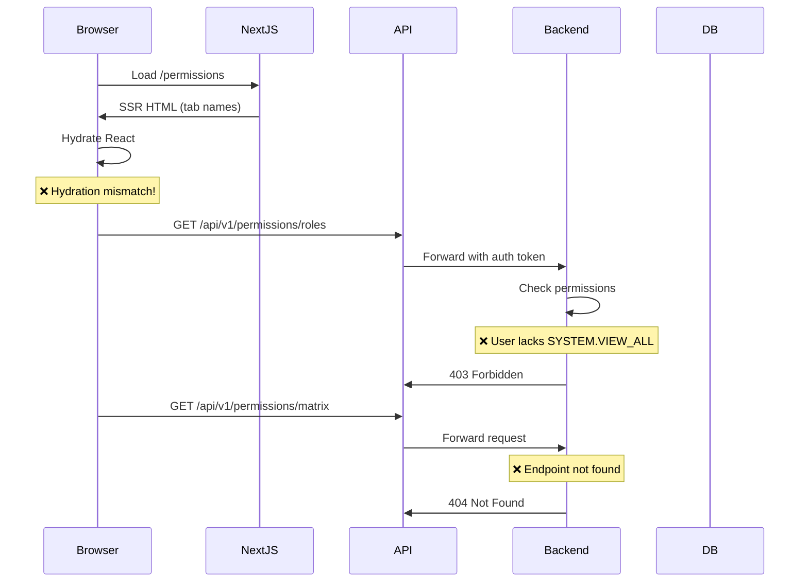
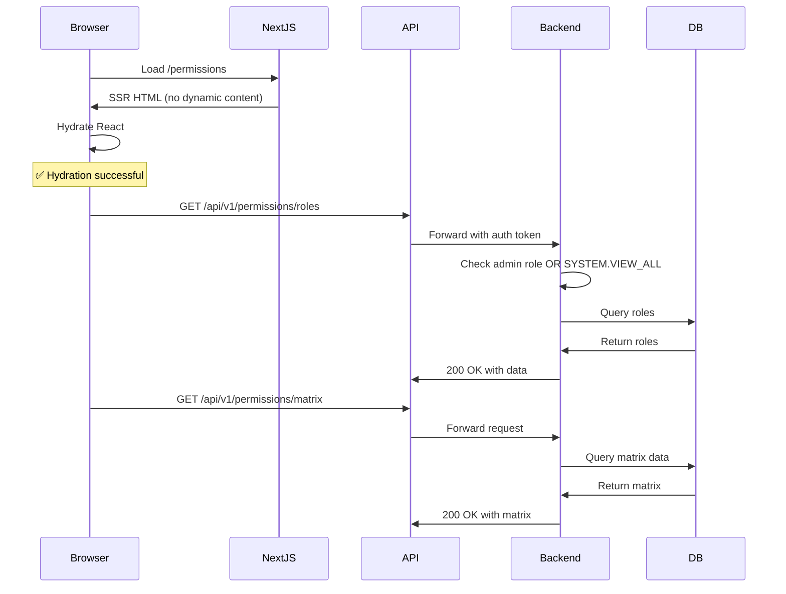

# Permission System Bug Fixes - Design Document

## Overview

This design document provides comprehensive solutions for the critical bugs discovered in the Permission Management System. The issues stem from three main areas: React hydration mismatches, backend authorization configuration, and missing API endpoints. The design focuses on immediate fixes while maintaining system stability and security.

## Architecture

### Current System Flow (With Issues)



### Target System Flow (Fixed)



## Components and Interfaces

### 1. Fix Hydration Mismatch in Permissions Page

#### Root Cause Analysis

The hydration error occurs because:
1. Server renders tab button with text "Permission Templates"
2. Client renders tab button with text "Permissions"
3. React detects mismatch and throws error

#### Solution: Ensure Consistent Rendering

```typescript
// lc-workflow-frontend/app/permissions/page.tsx

// BEFORE (causes hydration mismatch):
const tabs = [
  {
    id: 'permissions',
    name: 'Permissions',  // ❌ This changes between renders
    icon: KeyIcon,
    description: 'Manage individual permissions'
  },
  // ...
];

// AFTER (consistent rendering):
const tabs = [
  {
    id: 'permissions',
    name: 'Permissions',  // ✅ Always the same
    icon: KeyIcon,
    description: 'Manage individual permissions'
  },
  {
    id: 'templates',
    name: 'Permission Templates',  // ✅ Separate tab
    icon: DocumentTextIcon,
    description: 'Create and apply permission templates'
  },
  // ...
];
```

#### Implementation Strategy

1. **Disable SSR for Dynamic Components**
   ```typescript
   // All heavy components already use ssr: false
   const PermissionMatrix = dynamic(
     () => import('@/components/permissions/PermissionMatrix'),
     { ssr: false, loading: () => <LoadingSkeleton /> }
   );
   ```

2. **Use Client-Only Rendering for State-Dependent Content**
   ```typescript
   'use client';  // Already present
   
   export default function PermissionsPage() {
     const [mounted, setMounted] = useState(false);
     
     useEffect(() => {
       setMounted(true);
     }, []);
     
     if (!mounted) {
       return <LoadingSkeleton />;
     }
     
     // Render full page
   }
   ```

3. **Fix Tab Name Consistency**
   - Ensure tab names never change based on state
   - Use separate tabs instead of conditional naming
   - Verify all text content is static

### 2. Fix Permission API Authorization

#### Root Cause Analysis

The 403 errors occur because:
1. Backend requires `SYSTEM.VIEW_ALL` permission
2. Admin users may not have this specific permission
3. Permission seeding may be incomplete

#### Solution: Update Permission Checks

```python
# le-backend/app/routers/permissions.py

# BEFORE (too restrictive):
@router.get("/roles", response_model=List[RoleResponse])
@require_permission(ResourceType.SYSTEM, PermissionAction.VIEW_ALL)
async def list_roles(...):
    # Only users with SYSTEM.VIEW_ALL can access
    pass

# AFTER (allow admin role):
@router.get("/roles", response_model=List[RoleResponse])
async def list_roles(
    current_user: User = Depends(get_current_user),
    db: AsyncSession = Depends(get_db)
):
    # Check if user is admin OR has SYSTEM.VIEW_ALL permission
    permission_service = PermissionService(db)
    
    if current_user.role != 'admin':
        has_permission = await permission_service.check_permission(
            user_id=current_user.id,
            resource_type=ResourceType.SYSTEM,
            action=PermissionAction.VIEW_ALL
        )
        if not has_permission:
            raise HTTPException(
                status_code=403,
                detail={
                    "error": "insufficient_permissions",
                    "message": "You need SYSTEM.VIEW_ALL permission or admin role to access this resource",
                    "required_permission": "SYSTEM.VIEW_ALL",
                    "required_role": "admin"
                }
            )
    
    # Proceed with listing roles
    query = select(Role).options(selectinload(Role.role_permissions))
    # ...
```

#### Alternative: Create Flexible Permission Decorator

```python
# le-backend/app/services/permission_service.py

def require_permission_or_role(
    resource_type: ResourceType,
    action: PermissionAction,
    allowed_roles: List[str] = None
):
    """
    Decorator that checks for specific permission OR role membership
    """
    def decorator(func):
        @wraps(func)
        async def wrapper(*args, **kwargs):
            # Extract current_user and db from kwargs
            current_user = kwargs.get('current_user')
            db = kwargs.get('db')
            
            if not current_user:
                raise HTTPException(status_code=401, detail="Not authenticated")
            
            # Check if user has allowed role
            if allowed_roles and current_user.role in allowed_roles:
                return await func(*args, **kwargs)
            
            # Check if user has required permission
            permission_service = PermissionService(db)
            has_permission = await permission_service.check_permission(
                user_id=current_user.id,
                resource_type=resource_type,
                action=action
            )
            
            if not has_permission:
                raise HTTPException(
                    status_code=403,
                    detail={
                        "error": "insufficient_permissions",
                        "message": f"You need {resource_type.value}.{action.value} permission or one of these roles: {', '.join(allowed_roles or [])}",
                        "required_permission": f"{resource_type.value}.{action.value}",
                        "required_roles": allowed_roles
                    }
                )
            
            return await func(*args, **kwargs)
        return wrapper
    return decorator

# Usage:
@router.get("/roles", response_model=List[RoleResponse])
@require_permission_or_role(
    ResourceType.SYSTEM, 
    PermissionAction.VIEW_ALL,
    allowed_roles=['admin', 'manager']
)
async def list_roles(...):
    pass
```

### 3. Implement Missing Permission Matrix Endpoint

#### Root Cause Analysis

The 404 error occurs because:
1. Frontend expects `/api/v1/permissions/matrix`
2. Backend may have the endpoint but it's not accessible
3. Or the endpoint doesn't exist at all

#### Solution: Verify and Fix Matrix Endpoint

```python
# le-backend/app/routers/permissions.py

@router.get("/matrix", response_model=PermissionMatrixResponse)
@require_permission_or_role(
    ResourceType.SYSTEM,
    PermissionAction.VIEW_ALL,
    allowed_roles=['admin']
)
async def get_permission_matrix(
    current_user: User = Depends(get_current_user),
    db: AsyncSession = Depends(get_db)
):
    """
    Get the permission matrix showing which roles have which permissions.
    Returns a matrix of roles vs permissions with indicators.
    """
    try:
        # Fetch all active roles with their permissions
        roles_query = select(Role).options(
            selectinload(Role.role_permissions).selectinload(RolePermission.permission)
        ).where(Role.is_active == True).order_by(Role.level, Role.display_name)
        
        roles_result = await db.execute(roles_query)
        roles = roles_result.scalars().all()
        
        # Fetch all active permissions
        permissions_query = select(Permission).where(
            Permission.is_active == True
        ).order_by(
            Permission.resource_type,
            Permission.action,
            Permission.scope
        )
        
        permissions_result = await db.execute(permissions_query)
        permissions = permissions_result.scalars().all()
        
        # Build matrix data structure
        matrix_data = {
            "roles": [
                {
                    "id": str(role.id),
                    "name": role.name,
                    "display_name": role.display_name,
                    "level": role.level,
                    "is_system_role": role.is_system_role
                }
                for role in roles
            ],
            "permissions": [
                {
                    "id": str(perm.id),
                    "name": perm.name,
                    "resource_type": perm.resource_type.value,
                    "action": perm.action.value,
                    "scope": perm.scope.value if perm.scope else None,
                    "is_system_permission": perm.is_system_permission
                }
                for perm in permissions
            ],
            "assignments": {}
        }
        
        # Build assignments map: role_id -> [permission_ids]
        for role in roles:
            role_id = str(role.id)
            matrix_data["assignments"][role_id] = [
                str(rp.permission_id)
                for rp in role.role_permissions
            ]
        
        return PermissionMatrixResponse(**matrix_data)
        
    except Exception as e:
        logger.error(f"Error fetching permission matrix: {e}")
        raise HTTPException(
            status_code=500,
            detail={
                "error": "matrix_fetch_failed",
                "message": "Failed to fetch permission matrix",
                "details": str(e) if settings.DEBUG else None
            }
        )
```

#### Matrix Response Schema

```python
# le-backend/app/permission_schemas.py

class PermissionMatrixRole(BaseModel):
    id: str
    name: str
    display_name: str
    level: int
    is_system_role: bool

class PermissionMatrixPermission(BaseModel):
    id: str
    name: str
    resource_type: str
    action: str
    scope: Optional[str]
    is_system_permission: bool

class PermissionMatrixResponse(BaseModel):
    roles: List[PermissionMatrixRole]
    permissions: List[PermissionMatrixPermission]
    assignments: Dict[str, List[str]]  # role_id -> [permission_ids]
    
    class Config:
        json_schema_extra = {
            "example": {
                "roles": [
                    {
                        "id": "uuid-1",
                        "name": "admin",
                        "display_name": "Administrator",
                        "level": 100,
                        "is_system_role": True
                    }
                ],
                "permissions": [
                    {
                        "id": "uuid-2",
                        "name": "SYSTEM.VIEW_ALL",
                        "resource_type": "SYSTEM",
                        "action": "VIEW_ALL",
                        "scope": None,
                        "is_system_permission": True
                    }
                ],
                "assignments": {
                    "uuid-1": ["uuid-2"]
                }
            }
        }
```

### 4. Fix Frontend API Client

#### Update API Client to Handle Errors Better

```typescript
// lc-workflow-frontend/src/lib/api/permissions.ts

export const permissionsApi = {
  async getMatrix(): Promise<PermissionMatrixResponse> {
    try {
      const response = await apiClient.get<PermissionMatrixResponse>(
        '/permissions/matrix'
      );
      return response.data;
    } catch (error) {
      if (axios.isAxiosError(error)) {
        if (error.response?.status === 403) {
          throw new PermissionError(
            'You do not have permission to view the permission matrix. Please contact your administrator.',
            'SYSTEM.VIEW_ALL'
          );
        } else if (error.response?.status === 404) {
          throw new ApiError(
            'Permission matrix endpoint not found. Please ensure the backend is up to date.',
            404
          );
        }
      }
      throw error;
    }
  },

  async listRoles(params?: RoleListParams): Promise<Role[]> {
    try {
      const response = await apiClient.get<Role[]>('/permissions/roles', {
        params
      });
      return response.data;
    } catch (error) {
      if (axios.isAxiosError(error)) {
        if (error.response?.status === 403) {
          const detail = error.response.data?.detail;
          throw new PermissionError(
            detail?.message || 'You do not have permission to view roles.',
            detail?.required_permission || 'SYSTEM.VIEW_ALL'
          );
        }
      }
      throw error;
    }
  },

  async listTemplates(): Promise<PermissionTemplate[]> {
    try {
      const response = await apiClient.get<PermissionTemplate[]>(
        '/permissions/templates'
      );
      return response.data;
    } catch (error) {
      if (axios.isAxiosError(error)) {
        if (error.response?.status === 403) {
          throw new PermissionError(
            'You do not have permission to view permission templates.',
            'SYSTEM.READ'
          );
        }
      }
      throw error;
    }
  }
};
```

#### Custom Error Classes

```typescript
// lc-workflow-frontend/src/lib/api/permissionErrors.ts

export class PermissionError extends Error {
  constructor(
    message: string,
    public requiredPermission: string,
    public requiredRoles?: string[]
  ) {
    super(message);
    this.name = 'PermissionError';
  }
}

export class ApiError extends Error {
  constructor(
    message: string,
    public statusCode: number
  ) {
    super(message);
    this.name = 'ApiError';
  }
}
```

### 5. Fix Content Security Policy

#### Update CSP Headers

```typescript
// lc-workflow-frontend/next.config.ts

const nextConfig = {
  async headers() {
    return [
      {
        source: '/:path*',
        headers: [
          {
            key: 'Content-Security-Policy',
            value: [
              "default-src 'self'",
              "script-src 'self' 'unsafe-eval' 'unsafe-inline'",
              "style-src 'self' 'unsafe-inline'",
              "img-src 'self' data: blob: https:",
              "font-src 'self' data:",  // ✅ Allow data: URIs for fonts
              "connect-src 'self' http://localhost:8090 ws://localhost:3000",
              "frame-ancestors 'none'",
              "base-uri 'self'",
              "form-action 'self'"
            ].join('; ')
          }
        ]
      }
    ];
  }
};
```

#### Remove External Font References

```typescript
// lc-workflow-frontend/app/permissions/page.tsx

// REMOVE any external font imports
// If fonts are needed, use Next.js font optimization:

import { Inter } from 'next/font/google';

const inter = Inter({ subsets: ['latin'] });

export default function PermissionsPage() {
  return (
    <div className={inter.className}>
      {/* Page content */}
    </div>
  );
}
```

### 6. Implement Permission Seeding

#### Create Seed Script

```python
# le-backend/scripts/seed_permissions.py

async def seed_default_permissions(db: AsyncSession):
    """
    Seed default permissions and roles for the system
    """
    logger.info("Starting permission seeding...")
    
    # Define system permissions
    system_permissions = [
        {
            "name": "SYSTEM.VIEW_ALL",
            "resource_type": ResourceType.SYSTEM,
            "action": PermissionAction.VIEW_ALL,
            "description": "View all system resources and settings",
            "is_system_permission": True
        },
        {
            "name": "SYSTEM.CREATE",
            "resource_type": ResourceType.SYSTEM,
            "action": PermissionAction.CREATE,
            "description": "Create system resources",
            "is_system_permission": True
        },
        {
            "name": "SYSTEM.UPDATE",
            "resource_type": ResourceType.SYSTEM,
            "action": PermissionAction.UPDATE,
            "description": "Update system resources",
            "is_system_permission": True
        },
        {
            "name": "SYSTEM.DELETE",
            "resource_type": ResourceType.SYSTEM,
            "action": PermissionAction.DELETE,
            "description": "Delete system resources",
            "is_system_permission": True
        },
        {
            "name": "SYSTEM.READ",
            "resource_type": ResourceType.SYSTEM,
            "action": PermissionAction.READ,
            "description": "Read system resources",
            "is_system_permission": True
        }
    ]
    
    # Create permissions if they don't exist
    created_permissions = []
    for perm_data in system_permissions:
        existing = await db.execute(
            select(Permission).where(Permission.name == perm_data["name"])
        )
        if not existing.scalar_one_or_none():
            permission = Permission(**perm_data)
            db.add(permission)
            created_permissions.append(permission)
            logger.info(f"Created permission: {perm_data['name']}")
    
    await db.commit()
    
    # Create admin role if it doesn't exist
    admin_role_query = await db.execute(
        select(Role).where(Role.name == "admin")
    )
    admin_role = admin_role_query.scalar_one_or_none()
    
    if not admin_role:
        admin_role = Role(
            name="admin",
            display_name="Administrator",
            description="Full system access",
            level=100,
            is_system_role=True,
            is_active=True
        )
        db.add(admin_role)
        await db.commit()
        await db.refresh(admin_role)
        logger.info("Created admin role")
    
    # Assign all permissions to admin role
    all_permissions = await db.execute(select(Permission))
    for permission in all_permissions.scalars().all():
        existing_assignment = await db.execute(
            select(RolePermission).where(
                and_(
                    RolePermission.role_id == admin_role.id,
                    RolePermission.permission_id == permission.id
                )
            )
        )
        if not existing_assignment.scalar_one_or_none():
            role_permission = RolePermission(
                role_id=admin_role.id,
                permission_id=permission.id
            )
            db.add(role_permission)
    
    await db.commit()
    logger.info("Permission seeding completed")

# Run on startup
@app.on_event("startup")
async def startup_event():
    async with get_db() as db:
        await seed_default_permissions(db)
```

### 7. Add Health Check Endpoint

```python
# le-backend/app/routers/permissions.py

@router.get("/health")
async def permission_system_health(
    db: AsyncSession = Depends(get_db)
):
    """
    Check health of permission system
    """
    health_status = {
        "status": "healthy",
        "checks": {},
        "timestamp": datetime.utcnow().isoformat()
    }
    
    try:
        # Check if permission tables exist and have data
        permission_count = await db.scalar(select(func.count(Permission.id)))
        role_count = await db.scalar(select(func.count(Role.id)))
        
        health_status["checks"]["permissions"] = {
            "status": "healthy" if permission_count > 0 else "warning",
            "count": permission_count
        }
        
        health_status["checks"]["roles"] = {
            "status": "healthy" if role_count > 0 else "warning",
            "count": role_count
        }
        
        # Check if admin role exists
        admin_role = await db.scalar(
            select(Role).where(Role.name == "admin")
        )
        health_status["checks"]["admin_role"] = {
            "status": "healthy" if admin_role else "unhealthy",
            "exists": admin_role is not None
        }
        
        # Check if SYSTEM.VIEW_ALL permission exists
        view_all_perm = await db.scalar(
            select(Permission).where(Permission.name == "SYSTEM.VIEW_ALL")
        )
        health_status["checks"]["system_permissions"] = {
            "status": "healthy" if view_all_perm else "unhealthy",
            "exists": view_all_perm is not None
        }
        
        # Overall status
        if any(
            check["status"] == "unhealthy" 
            for check in health_status["checks"].values()
        ):
            health_status["status"] = "unhealthy"
        elif any(
            check["status"] == "warning" 
            for check in health_status["checks"].values()
        ):
            health_status["status"] = "degraded"
        
    except Exception as e:
        health_status["status"] = "unhealthy"
        health_status["error"] = str(e)
    
    return health_status
```

## Error Handling

### Enhanced Error Responses

```python
# le-backend/app/core/exceptions.py

class PermissionDeniedError(HTTPException):
    def __init__(
        self,
        required_permission: str = None,
        required_roles: List[str] = None,
        message: str = None
    ):
        detail = {
            "error": "permission_denied",
            "message": message or "You do not have permission to perform this action",
            "required_permission": required_permission,
            "required_roles": required_roles,
            "suggestion": "Please contact your administrator to request access"
        }
        super().__init__(status_code=403, detail=detail)

class ResourceNotFoundError(HTTPException):
    def __init__(self, resource_type: str, resource_id: str = None):
        detail = {
            "error": "resource_not_found",
            "message": f"{resource_type} not found",
            "resource_type": resource_type,
            "resource_id": resource_id
        }
        super().__init__(status_code=404, detail=detail)
```

### Frontend Error Display

```typescript
// lc-workflow-frontend/src/components/permissions/PermissionErrorBoundary.tsx

export function PermissionErrorBoundary({ children }: { children: React.ReactNode }) {
  return (
    <ErrorBoundary
      fallback={(error) => {
        if (error instanceof PermissionError) {
          return (
            <div className="bg-red-50 border border-red-200 rounded-lg p-6">
              <div className="flex items-start">
                <ExclamationTriangleIcon className="h-6 w-6 text-red-600 mr-3" />
                <div>
                  <h3 className="text-lg font-medium text-red-900">
                    Permission Denied
                  </h3>
                  <p className="mt-2 text-sm text-red-700">
                    {error.message}
                  </p>
                  <div className="mt-4 text-sm text-red-600">
                    <p className="font-medium">Required Permission:</p>
                    <code className="bg-red-100 px-2 py-1 rounded">
                      {error.requiredPermission}
                    </code>
                  </div>
                  <p className="mt-4 text-sm text-red-600">
                    Please contact your system administrator to request access.
                  </p>
                </div>
              </div>
            </div>
          );
        }
        
        return <DefaultErrorFallback error={error} />;
      }}
    >
      {children}
    </ErrorBoundary>
  );
}
```

## Testing Strategy

### Unit Tests

```python
# le-backend/tests/test_permission_fixes.py

async def test_admin_can_access_roles_endpoint():
    """Test that admin users can access roles endpoint"""
    admin_user = await create_test_user(role="admin")
    response = await client.get(
        "/api/v1/permissions/roles",
        headers={"Authorization": f"Bearer {admin_user.token}"}
    )
    assert response.status_code == 200

async def test_non_admin_with_permission_can_access_roles():
    """Test that non-admin with SYSTEM.VIEW_ALL can access roles"""
    user = await create_test_user(role="manager")
    await grant_permission(user.id, "SYSTEM.VIEW_ALL")
    
    response = await client.get(
        "/api/v1/permissions/roles",
        headers={"Authorization": f"Bearer {user.token}"}
    )
    assert response.status_code == 200

async def test_permission_matrix_endpoint_exists():
    """Test that permission matrix endpoint returns data"""
    admin_user = await create_test_user(role="admin")
    response = await client.get(
        "/api/v1/permissions/matrix",
        headers={"Authorization": f"Bearer {admin_user.token}"}
    )
    assert response.status_code == 200
    assert "roles" in response.json()
    assert "permissions" in response.json()
    assert "assignments" in response.json()
```

### Integration Tests

```typescript
// lc-workflow-frontend/src/components/permissions/__tests__/PermissionsPage.test.tsx

describe('PermissionsPage', () => {
  it('should render without hydration errors', async () => {
    const { container } = render(<PermissionsPage />);
    
    // Wait for client-side hydration
    await waitFor(() => {
      expect(container.querySelector('[data-testid="permissions-tabs"]')).toBeInTheDocument();
    });
    
    // Verify no hydration errors in console
    expect(console.error).not.toHaveBeenCalled();
  });
  
  it('should load permission matrix without 404 errors', async () => {
    render(<PermissionsPage />);
    
    // Click on matrix tab
    const matrixTab = screen.getByText('Permission Matrix');
    fireEvent.click(matrixTab);
    
    // Wait for data to load
    await waitFor(() => {
      expect(screen.queryByText('Loading...')).not.toBeInTheDocument();
    });
    
    // Verify matrix is displayed
    expect(screen.getByTestId('permission-matrix')).toBeInTheDocument();
  });
});
```

## Deployment Strategy

### Step 1: Backend Fixes
1. Update permission decorators to allow admin role
2. Verify matrix endpoint exists and is accessible
3. Run permission seeding script
4. Deploy backend changes

### Step 2: Frontend Fixes
1. Fix hydration issues in permissions page
2. Update API client error handling
3. Update CSP headers
4. Deploy frontend changes

### Step 3: Verification
1. Run health check endpoint
2. Test permission page loads without errors
3. Verify all API endpoints return 200 for admin users
4. Check browser console for errors

### Rollback Plan
If issues occur:
1. Revert frontend deployment
2. Revert backend deployment
3. Restore previous permission configuration
4. Investigate and fix issues before redeploying

This design provides comprehensive solutions for all identified bugs while maintaining system security and stability.
