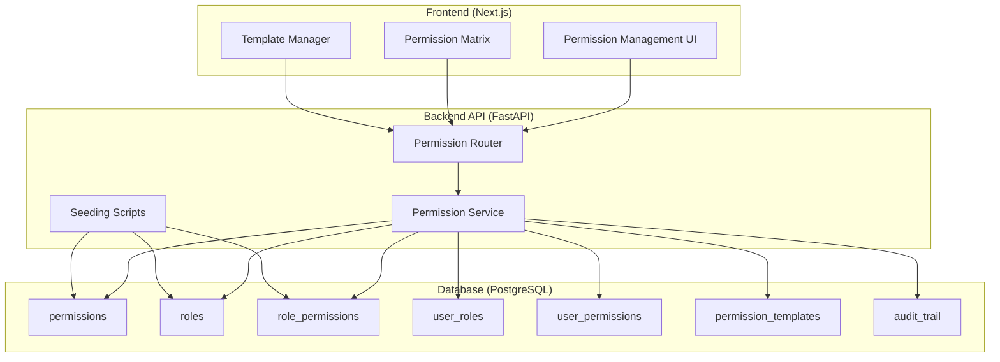

# Design Document

## Overview

This design document outlines the implementation of a comprehensive permission template system with real-world standard roles for the LC Workflow application. The system builds upon the existing permission infrastructure (Permission, Role, RolePermission, UserRole, UserPermission, PermissionTemplate models) to provide:

1. **Pre-configured Standard Roles** - Industry-standard roles for microfinance institutions
2. **Enhanced Permission Seeding** - Comprehensive database seeding with realistic data
3. **Template Management** - Create, apply, and manage permission templates
4. **Permission Matrix UI** - Visual interface for managing role-permission assignments
5. **Audit Trail** - Complete tracking of all permission changes
6. **Import/Export** - Share configurations between environments

The design leverages the existing FastAPI backend with SQLAlchemy async ORM and PostgreSQL database, following established patterns in the codebase.

## Architecture

### High-Level Architecture



### Data Flow

1. **Seeding Flow**: Script → Database (creates roles, permissions, assignments)
2. **Template Creation**: Admin UI → API → Service → Database
3. **Template Application**: Admin UI → API → Service → Creates UserRole/UserPermission records
4. **Permission Check**: User Action → Service → Database → Authorization Decision
5. **Audit Trail**: Any Change → Service → Audit Table

## Components and Interfaces

### 1. Enhanced Seeding Script

**File**: `le-backend/scripts/seed_standard_roles.py`

**Purpose**: Seed the database with comprehensive, real-world standard roles and permissions.

**Key Functions**:

```python
async def seed_comprehensive_permissions(db: AsyncSession) -> Dict[str, Any]:
    """
    Create all necessary permissions for the system.
    Returns dict with created permission IDs mapped by name.
    """
    # Define all permission combinations
    # Resource types: USER, APPLICATION, DEPARTMENT, BRANCH, FILE, FOLDER, 
    #                 ANALYTICS, NOTIFICATION, AUDIT, SYSTEM
    # Actions: CREATE, READ, UPDATE, DELETE, APPROVE, REJECT, ASSIGN, 
    #          EXPORT, MANAGE, VIEW_ALL
    # Scopes: OWN, DEPARTMENT, BRANCH, GLOBAL
    pass

async def seed_standard_roles(db: AsyncSession, permissions: Dict[str, UUID]) -> Dict[str, Role]:
    """
    Create standard roles with appropriate permission assignments.
    Returns dict of created roles mapped by name.
    """
    # Roles to create:
    # - admin (level 100)
    # - branch_manager (level 80)
    # - credit_officer (level 60)
    # - portfolio_officer (level 50)
    # - teller (level 40)
    # - reviewer (level 70)
    # - data_entry_clerk (level 30)
    pass

async def create_default_templates(db: AsyncSession, roles: Dict[str, Role]) -> List[PermissionTemplate]:
    """
    Create default permission templates based on standard roles.
    """
    pass
```

**Permission Definitions**:

The script will create permissions following this naming convention:
- Format: `{RESOURCE}.{ACTION}.{SCOPE}`
- Examples:
  - `APPLICATION.CREATE.OWN` - Create own applications
  - `APPLICATION.APPROVE.DEPARTMENT` - Approve applications in department
  - `USER.MANAGE.BRANCH` - Manage users in branch
  - `ANALYTICS.VIEW_ALL.GLOBAL` - View all analytics globally

**Standard Role Definitions**:

1. **Admin** (Level 100)
   - All permissions with GLOBAL scope
   - System management capabilities
   - User and role management
   - Full audit trail access

2. **Branch Manager** (Level 80)
   - APPLICATION: APPROVE, REJECT, VIEW_ALL (BRANCH scope)
   - USER: READ, UPDATE, ASSIGN (BRANCH scope)
   - ANALYTICS: VIEW_ALL (BRANCH scope)
   - DEPARTMENT: READ (BRANCH scope)

3. **Credit Officer** (Level 60)
   - APPLICATION: CREATE, READ, UPDATE, ASSIGN (DEPARTMENT scope)
   - APPLICATION: APPROVE, REJECT (OWN scope)
   - FILE: CREATE, READ, UPDATE, DELETE (OWN scope)
   - ANALYTICS: READ (DEPARTMENT scope)

4. **Portfolio Officer** (Level 50)
   - APPLICATION: CREATE, READ, UPDATE (OWN scope)
   - FILE: CREATE, READ, UPDATE (OWN scope)
   - ANALYTICS: READ (OWN scope)

5. **Teller** (Level 40)
   - APPLICATION: READ, UPDATE (assigned applications only)
   - FILE: READ (assigned applications only)
   - Specific permission for account ID validation

6. **Reviewer/Auditor** (Level 70)
   - APPLICATION: READ (GLOBAL scope)
   - AUDIT: READ (GLOBAL scope)
   - ANALYTICS: VIEW_ALL, EXPORT (GLOBAL scope)
   - No CREATE, UPDATE, DELETE permissions

7. **Data Entry Clerk** (Level 30)
   - APPLICATION: CREATE (OWN scope, draft only)
   - FILE: CREATE, READ, UPDATE (OWN scope)
   - Limited read access

### 2. Permission Service Enhancements

**File**: `le-backend/app/services/permission_service.py`

**New Methods**:

```python
class PermissionService:
    async def apply_permission_template(
        self,
        template_id: UUID,
        target_id: UUID,
        target_type: str,  # 'role' or 'user'
        applied_by: UUID
    ) -> bool:
        """
        Apply a permission template to a role or user.
        Creates appropriate RolePermission or UserRole records.
        Logs the action in audit trail.
        """
        pass
    
    async def create_role_from_template(
        self,
        template_id: UUID,
        role_name: str,
        role_display_name: str,
        role_description: str,
        created_by: UUID
    ) -> Role:
        """
        Create a new role based on a permission template.
        """
        pass
    
    async def export_template(
        self,
        template_id: UUID
    ) -> Dict[str, Any]:
        """
        Export a permission template to a portable JSON format.
        Uses permission names instead of IDs for portability.
        """
        pass
    
    async def import_template(
        self,
        template_data: Dict[str, Any],
        imported_by: UUID,
        update_if_exists: bool = False
    ) -> PermissionTemplate:
        """
        Import a permission template from JSON format.
        Maps permission names to IDs in the target system.
        """
        pass
    
    async def get_permission_matrix(
        self,
        include_inactive: bool = False
    ) -> Dict[str, Any]:
        """
        Get a comprehensive permission matrix showing all roles and their permissions.
        Returns structured data for UI rendering.
        """
        pass
    
    async def log_permission_change(
        self,
        action: str,
        entity_type: str,
        entity_id: UUID,
        user_id: UUID,
        details: Dict[str, Any],
        ip_address: Optional[str] = None
    ) -> None:
        """
        Log a permission-related change to the audit trail.
        """
        pass
```

### 3. API Router Enhancements

**File**: `le-backend/app/routers/permissions.py`

**New Endpoints**:

```python
# Template Management
POST   /api/permissions/templates                    # Create template
GET    /api/permissions/templates                    # List templates
GET    /api/permissions/templates/{id}               # Get template details
PUT    /api/permissions/templates/{id}               # Update template
DELETE /api/permissions/templates/{id}               # Delete template
POST   /api/permissions/templates/{id}/apply         # Apply template to user/role
POST   /api/permissions/templates/export/{id}        # Export template
POST   /api/permissions/templates/import             # Import template

# Role Management
POST   /api/permissions/roles/from-template          # Create role from template
GET    /api/permissions/roles/standard               # Get standard roles

# Permission Matrix
GET    /api/permissions/matrix                       # Get permission matrix
PUT    /api/permissions/matrix/toggle                # Toggle permission for role

# Audit Trail
GET    /api/permissions/audit                        # Get audit trail
GET    /api/permissions/audit/export                 # Export audit logs
```

### 4. Database Schema Additions

**New Table**: `permission_audit_trail`

```sql
CREATE TABLE permission_audit_trail (
    id BIGSERIAL PRIMARY KEY,
    action VARCHAR(50) NOT NULL,  -- 'role_created', 'permission_granted', etc.
    entity_type VARCHAR(50) NOT NULL,  -- 'role', 'permission', 'user', 'template'
    entity_id UUID,
    user_id UUID REFERENCES users(id),
    target_user_id UUID REFERENCES users(id),
    target_role_id UUID REFERENCES roles(id),
    permission_id UUID REFERENCES permissions(id),
    details JSONB,
    reason TEXT,
    ip_address VARCHAR(45),
    timestamp TIMESTAMP WITH TIME ZONE DEFAULT NOW(),
    
    INDEX idx_audit_action (action),
    INDEX idx_audit_entity (entity_type, entity_id),
    INDEX idx_audit_user (user_id),
    INDEX idx_audit_timestamp (timestamp)
);
```

**Enhancements to Existing Tables**:

The existing `permission_templates` table already has the necessary structure. We'll utilize:
- `permissions` (JSON array of permission IDs)
- `template_type` (to distinguish standard vs custom templates)
- `is_system_template` (to protect standard templates)
- `usage_count` (to track template usage)

### 5. Frontend Components

**New Pages/Components**:

1. **Permission Matrix Page** (`lc-workflow-frontend/app/admin/permissions/matrix/page.tsx`)
   - Grid view of roles vs permissions
   - Toggle permissions on/off
   - Filter by resource type, action, scope
   - Visual indicators for system roles/permissions

2. **Template Manager** (`lc-workflow-frontend/app/admin/permissions/templates/page.tsx`)
   - List all templates
   - Create new templates
   - Apply templates to users/roles
   - Export/import templates

3. **Role Management** (`lc-workflow-frontend/app/admin/permissions/roles/page.tsx`)
   - List all roles
   - Create roles from templates
   - View role details and permissions
   - Assign roles to users

4. **Audit Trail Viewer** (`lc-workflow-frontend/app/admin/permissions/audit/page.tsx`)
   - Filterable audit log
   - Export capabilities
   - Detailed view of changes

**Component Structure**:

```typescript
// Permission Matrix Component
interface PermissionMatrixProps {
  roles: Role[];
  permissions: Permission[];
  assignments: Record<string, string[]>;
  onToggle: (roleId: string, permissionId: string) => Promise<void>;
}

// Template Manager Component
interface TemplateManagerProps {
  templates: PermissionTemplate[];
  onApply: (templateId: string, targetId: string, targetType: string) => Promise<void>;
  onExport: (templateId: string) => Promise<void>;
  onImport: (file: File) => Promise<void>;
}
```

## Data Models

### Permission Template Structure

```typescript
interface PermissionTemplate {
  id: string;
  name: string;
  description: string;
  template_type: 'role' | 'department' | 'position' | 'custom';
  permissions: string[];  // Array of permission IDs
  default_conditions: Record<string, any> | null;
  is_system_template: boolean;
  is_active: boolean;
  usage_count: number;
  created_at: string;
  updated_at: string;
  created_by: string;
}
```

### Exportable Template Format

```json
{
  "name": "Branch Manager Template",
  "description": "Standard permissions for branch managers",
  "template_type": "role",
  "version": "1.0",
  "permissions": [
    {
      "resource_type": "APPLICATION",
      "action": "APPROVE",
      "scope": "BRANCH"
    },
    {
      "resource_type": "USER",
      "action": "READ",
      "scope": "BRANCH"
    }
  ],
  "default_conditions": {
    "require_branch_assignment": true
  }
}
```

### Audit Trail Entry

```typescript
interface AuditTrailEntry {
  id: number;
  action: string;
  entity_type: string;
  entity_id: string | null;
  user_id: string | null;
  user_name: string | null;
  target_user_id: string | null;
  target_user_name: string | null;
  target_role_id: string | null;
  target_role_name: string | null;
  permission_id: string | null;
  permission_name: string | null;
  details: Record<string, any> | null;
  reason: string | null;
  ip_address: string | null;
  timestamp: string;
}
```

## Error Handling

### Validation Errors

1. **Template Creation**
   - Duplicate template name
   - Invalid permission IDs
   - Empty permission list
   - Invalid template type

2. **Template Application**
   - Template not found
   - Target user/role not found
   - Conflicting role assignments
   - Inactive template

3. **Role Creation**
   - Duplicate role name
   - Invalid hierarchy level
   - Circular role dependencies
   - Invalid parent role

4. **Import/Export**
   - Invalid JSON format
   - Missing required fields
   - Permission name not found in target system
   - Version mismatch

### Error Response Format

```json
{
  "error": "validation_error",
  "message": "Template name already exists",
  "details": {
    "field": "name",
    "value": "Branch Manager Template",
    "constraint": "unique"
  },
  "suggestions": [
    "Use a different template name",
    "Update the existing template instead"
  ]
}
```

## Testing Strategy

### Unit Tests

1. **Permission Service Tests**
   - Test `apply_permission_template()` with valid and invalid inputs
   - Test `create_role_from_template()` with various template types
   - Test `export_template()` and `import_template()` round-trip
   - Test `get_permission_matrix()` data structure
   - Test audit logging for all operations

2. **Seeding Script Tests**
   - Test idempotency (running script multiple times)
   - Test permission creation with all combinations
   - Test role creation with correct permission assignments
   - Test template creation from roles

3. **API Endpoint Tests**
   - Test all CRUD operations for templates
   - Test template application to users and roles
   - Test permission matrix retrieval and updates
   - Test audit trail filtering and export
   - Test authorization (only admins can manage templates)

### Integration Tests

1. **End-to-End Template Workflow**
   - Create template → Apply to user → Verify permissions
   - Export template → Import in different environment → Verify
   - Create role from template → Assign to user → Test access

2. **Permission Matrix Workflow**
   - Load matrix → Toggle permissions → Verify database updates
   - Filter matrix → Verify correct data returned
   - Update system role → Verify protection

3. **Audit Trail Workflow**
   - Perform various permission changes → Verify audit entries
   - Filter audit trail → Verify correct filtering
   - Export audit logs → Verify format

### Manual Testing Checklist

- [ ] Run seeding script on fresh database
- [ ] Verify all standard roles created with correct permissions
- [ ] Create custom template and apply to test user
- [ ] Export template and import in different environment
- [ ] View permission matrix and toggle permissions
- [ ] Create new role from template
- [ ] Verify audit trail captures all changes
- [ ] Test with different user roles (admin, manager, officer)
- [ ] Verify error messages are clear and actionable

## Security Considerations

1. **Authorization**
   - Only admins can create/modify templates
   - Only admins can view permission matrix
   - Only admins can access audit trail
   - System templates cannot be deleted
   - System roles cannot be modified

2. **Audit Trail**
   - All permission changes must be logged
   - Include IP address for security tracking
   - Immutable audit records (no updates/deletes)
   - Retention policy for audit logs

3. **Template Import**
   - Validate JSON structure before processing
   - Sanitize all input fields
   - Require admin confirmation before applying
   - Preview changes before committing

4. **Data Integrity**
   - Use database transactions for all operations
   - Validate foreign key relationships
   - Prevent orphaned records
   - Handle concurrent modifications

## Performance Considerations

1. **Database Queries**
   - Use `selectinload` for eager loading relationships
   - Index frequently queried fields (user_id, role_id, permission_id)
   - Paginate large result sets (audit trail, permission list)
   - Cache permission matrix data (5-minute TTL)

2. **Seeding Performance**
   - Batch insert permissions (100 at a time)
   - Use bulk operations for role-permission assignments
   - Commit in chunks to avoid long transactions
   - Provide progress feedback for large datasets

3. **Frontend Performance**
   - Virtualize permission matrix for large datasets
   - Debounce filter inputs
   - Lazy load audit trail entries
   - Cache template list

## Migration Strategy

1. **Database Migration**
   - Create `permission_audit_trail` table
   - Add indexes for performance
   - No changes to existing tables (already have necessary structure)

2. **Data Migration**
   - Run seeding script to create standard roles
   - Create default templates from existing roles
   - Backfill audit trail for existing permission assignments (optional)

3. **Deployment Steps**
   1. Run database migration
   2. Deploy backend with new endpoints
   3. Run seeding script
   4. Deploy frontend with new UI components
   5. Verify standard roles and templates exist
   6. Test permission matrix and template application

## Rollback Plan

1. **Database Rollback**
   - Drop `permission_audit_trail` table
   - Remove seeded standard roles (if needed)
   - Remove created templates

2. **Code Rollback**
   - Revert backend to previous version
   - Revert frontend to previous version
   - Existing permission system continues to work

3. **Data Preservation**
   - Existing user roles and permissions are not affected
   - Custom roles created before deployment are preserved
   - Only new standard roles and templates are removed

## Future Enhancements

1. **Advanced Features**
   - Role inheritance (child roles inherit parent permissions)
   - Time-based permissions (effective from/until)
   - Conditional permissions (based on user attributes)
   - Permission groups for easier management

2. **UI Improvements**
   - Visual role hierarchy diagram
   - Permission comparison tool
   - Template versioning
   - Bulk user role assignment

3. **Analytics**
   - Permission usage statistics
   - Role adoption metrics
   - Audit trail analytics dashboard
   - Compliance reporting

4. **Integration**
   - LDAP/Active Directory sync
   - SSO integration with role mapping
   - External audit system integration
   - Webhook notifications for permission changes
