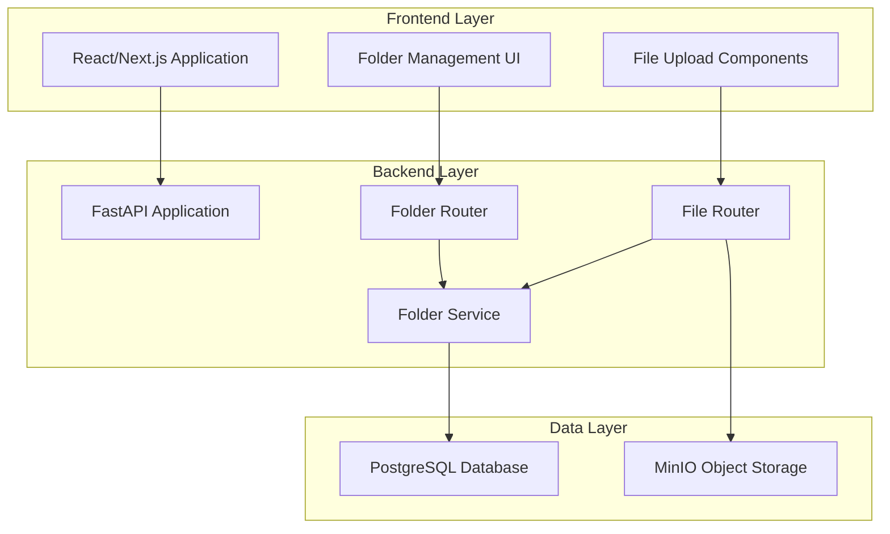
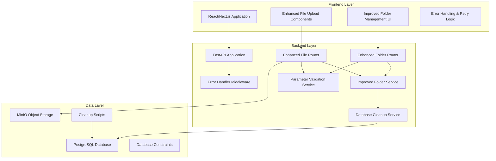

# System Stability Improvements - Design Document

## Overview

This design document outlines the comprehensive solution for resolving critical stability and functionality issues in the loan application system. The design addresses backend error handling, file upload parameter processing, folder organization, database integrity, and overall system reliability.

The solution follows a layered architecture approach with clear separation of concerns, robust error handling, and comprehensive testing strategies.

## Architecture

### Current System Architecture



### Target Architecture with Improvements



## Components and Interfaces

### 1. Enhanced File Upload Service

#### Current Issues
- Backend ignores `folder_id` parameter from form data
- Inconsistent parameter processing between query params and form data
- No proper validation of UUID parameters
- Missing error handling for invalid folder associations

#### Design Solution

```python
# Enhanced file upload endpoint
@router.post("/upload", response_model=FileResponse)
async def upload_file(
    file: UploadFile = File(),
    application_id: Optional[str] = Form(None),
    folder_id: Optional[str] = Form(None),
    document_type: Optional[str] = Form(None),
    field_name: Optional[str] = Form(None),
    current_user: User = Depends(get_current_user),
    db: AsyncSession = Depends(get_db)
) -> FileResponse:
    # Enhanced parameter validation and processing
    validated_params = await validate_upload_parameters(
        application_id, folder_id, document_type, field_name
    )
    
    # Improved file validation
    await validate_file_content(file)
    
    # Enhanced folder association logic
    final_folder_id = await resolve_folder_association(
        db, validated_params.application_id, 
        validated_params.folder_id, document_type
    )
    
    # Robust file upload with rollback capability
    return await process_file_upload(
        db, file, validated_params, final_folder_id, current_user
    )
```

#### Parameter Validation Service

```python
class UploadParameterValidator:
    @staticmethod
    async def validate_upload_parameters(
        application_id: Optional[str],
        folder_id: Optional[str],
        document_type: Optional[str],
        field_name: Optional[str]
    ) -> ValidatedUploadParams:
        """
        Validates and converts upload parameters with comprehensive error handling
        """
        validated = ValidatedUploadParams()
        
        # Validate application_id
        if application_id:
            try:
                validated.application_id = UUID(application_id)
            except ValueError:
                raise HTTPException(
                    status_code=400,
                    detail=f"Invalid application_id format: {application_id}"
                )
        
        # Validate folder_id
        if folder_id:
            try:
                validated.folder_id = UUID(folder_id)
            except ValueError:
                raise HTTPException(
                    status_code=400,
                    detail=f"Invalid folder_id format: {folder_id}"
                )
        
        # Validate document_type and field_name
        if document_type and document_type not in ALLOWED_DOCUMENT_TYPES:
            raise HTTPException(
                status_code=400,
                detail=f"Invalid document_type: {document_type}"
            )
        
        return validated
```

### 2. Improved Folder Service

#### Current Issues
- Multiple parent folders for same application causing 503 errors
- Inconsistent folder creation and reuse logic
- Race conditions in concurrent folder operations
- No proper cleanup of duplicate folders

#### Design Solution

```python
class EnhancedFolderService:
    async def get_or_create_application_folder_structure(
        self, db: AsyncSession, application_id: UUID
    ) -> Dict[str, UUID]:
        """
        Enhanced folder structure management with duplicate handling
        """
        async with db.begin():  # Use transaction for atomicity
            # Handle duplicate parent folders
            parent_folder = await self._resolve_parent_folder_duplicates(
                db, application_id
            )
            
            # Create standard folder structure
            folder_structure = await self._ensure_folder_structure(
                db, application_id, parent_folder
            )
            
            return folder_structure
    
    async def _resolve_parent_folder_duplicates(
        self, db: AsyncSession, application_id: UUID
    ) -> Folder:
        """
        Identifies and consolidates duplicate parent folders
        """
        parent_folders = await self._get_parent_folders(db, application_id)
        
        if len(parent_folders) == 0:
            return await self._create_parent_folder(db, application_id)
        elif len(parent_folders) == 1:
            return parent_folders[0]
        else:
            # Consolidate duplicates
            return await self._consolidate_duplicate_folders(
                db, parent_folders
            )
    
    async def _consolidate_duplicate_folders(
        self, db: AsyncSession, duplicate_folders: List[Folder]
    ) -> Folder:
        """
        Consolidates duplicate folders while preserving all data
        """
        primary_folder = duplicate_folders[0]
        
        for duplicate in duplicate_folders[1:]:
            # Move child folders
            await self._move_child_folders(db, duplicate, primary_folder)
            
            # Move files
            await self._move_files(db, duplicate, primary_folder)
            
            # Delete duplicate folder
            await db.delete(duplicate)
        
        await db.commit()
        return primary_folder
```

### 3. Database Integrity Service

#### Design Solution

```python
class DatabaseIntegrityService:
    async def cleanup_duplicate_folders(self, db: AsyncSession) -> CleanupReport:
        """
        Comprehensive database cleanup for folder duplicates
        """
        report = CleanupReport()
        
        # Identify applications with duplicate parent folders
        duplicate_apps = await self._find_applications_with_duplicate_folders(db)
        
        for app_id in duplicate_apps:
            try:
                result = await self._cleanup_application_folders(db, app_id)
                report.add_success(app_id, result)
            except Exception as e:
                report.add_error(app_id, str(e))
        
        return report
    
    async def _cleanup_application_folders(
        self, db: AsyncSession, application_id: UUID
    ) -> FolderCleanupResult:
        """
        Cleans up folders for a specific application
        """
        async with db.begin():
            parent_folders = await self._get_parent_folders(db, application_id)
            
            if len(parent_folders) <= 1:
                return FolderCleanupResult(
                    application_id=application_id,
                    folders_removed=0,
                    files_moved=0
                )
            
            # Consolidate folders
            primary_folder = parent_folders[0]
            files_moved = 0
            folders_removed = 0
            
            for duplicate in parent_folders[1:]:
                # Move child folders and files
                moved_files = await self._consolidate_folder_contents(
                    db, duplicate, primary_folder
                )
                files_moved += moved_files
                
                # Remove duplicate folder
                await db.delete(duplicate)
                folders_removed += 1
            
            return FolderCleanupResult(
                application_id=application_id,
                folders_removed=folders_removed,
                files_moved=files_moved
            )
```

### 4. Enhanced Error Handling

#### Global Error Handler

```python
class SystemErrorHandler:
    @staticmethod
    async def handle_database_error(
        request: Request, exc: Exception
    ) -> JSONResponse:
        """
        Handles database-related errors with appropriate responses
        """
        if "Multiple rows were found" in str(exc):
            # Trigger automatic cleanup
            await trigger_folder_cleanup(request.state.db)
            
            return JSONResponse(
                status_code=503,
                content={
                    "error": "temporary_database_inconsistency",
                    "message": "System is resolving data inconsistency. Please retry in a moment.",
                    "retry_after": 30
                }
            )
        
        # Handle other database errors
        return JSONResponse(
            status_code=500,
            content={
                "error": "database_error",
                "message": "A database error occurred. Please try again.",
                "details": str(exc) if settings.DEBUG else None
            }
        )
```

#### File Upload Error Recovery

```python
class FileUploadErrorRecovery:
    async def handle_upload_failure(
        self, db: AsyncSession, file_path: str, error: Exception
    ) -> None:
        """
        Handles file upload failures with cleanup
        """
        try:
            # Clean up partially uploaded file from MinIO
            if file_path:
                minio_service.delete_file(file_path)
            
            # Clean up database record if created
            await self._cleanup_orphaned_file_record(db, file_path)
            
        except Exception as cleanup_error:
            logger.error(f"Cleanup failed after upload error: {cleanup_error}")
```

## Data Models

### Enhanced File Model

```python
class File(Base):
    __tablename__ = "files"
    
    # Existing fields...
    
    # Enhanced fields for better tracking
    upload_status = Column(String(20), default='completed')  # uploading, completed, failed
    upload_error = Column(Text, nullable=True)  # Store error details
    retry_count = Column(Integer, default=0)  # Track retry attempts
    
    # Metadata for better organization
    document_category = Column(String(50), nullable=True)  # borrower, guarantor, collateral
    validation_status = Column(String(20), default='pending')  # pending, validated, rejected
    
    # Audit fields
    last_accessed_at = Column(DateTime(timezone=True), nullable=True)
    access_count = Column(Integer, default=0)
```

### Enhanced Folder Model

```python
class Folder(Base):
    __tablename__ = "folders"
    
    # Existing fields...
    
    # Enhanced fields for better management
    folder_type = Column(String(50), default='user_created')  # system, user_created, auto_generated
    is_system_folder = Column(Boolean, default=False)
    sort_order = Column(Integer, default=0)
    
    # Constraints to prevent duplicates
    __table_args__ = (
        Index('idx_unique_app_parent_folder', 'application_id', 'name', 
              postgresql_where=text('parent_id IS NULL')),
    )
```

### Database Constraints

```sql
-- Prevent duplicate parent folders for same application
ALTER TABLE folders 
ADD CONSTRAINT unique_application_parent_folder 
UNIQUE (application_id, name) 
WHERE parent_id IS NULL;

-- Ensure folder belongs to same application as parent
ALTER TABLE folders 
ADD CONSTRAINT check_folder_application_consistency 
CHECK (
    parent_id IS NULL OR 
    application_id = (
        SELECT application_id 
        FROM folders 
        WHERE id = parent_id
    )
);

-- Ensure files belong to same application as folder
ALTER TABLE files 
ADD CONSTRAINT check_file_folder_application_consistency 
CHECK (
    folder_id IS NULL OR 
    application_id = (
        SELECT application_id 
        FROM folders 
        WHERE id = folder_id
    )
);
```

## Error Handling

### Error Classification

```python
class SystemErrorTypes(Enum):
    # Database errors
    DUPLICATE_FOLDER_ERROR = "duplicate_folder_error"
    CONSTRAINT_VIOLATION = "constraint_violation"
    CONNECTION_ERROR = "database_connection_error"
    
    # File upload errors
    INVALID_FILE_TYPE = "invalid_file_type"
    FILE_TOO_LARGE = "file_too_large"
    STORAGE_ERROR = "storage_error"
    
    # Parameter errors
    INVALID_UUID = "invalid_uuid"
    MISSING_REQUIRED_PARAM = "missing_required_parameter"
    INVALID_FOLDER_ASSOCIATION = "invalid_folder_association"
    
    # System errors
    TEMPORARY_UNAVAILABLE = "temporary_unavailable"
    RATE_LIMIT_EXCEEDED = "rate_limit_exceeded"
```

### Error Response Format

```python
class ErrorResponse(BaseModel):
    error_type: str
    message: str
    details: Optional[Dict[str, Any]] = None
    retry_after: Optional[int] = None
    suggested_actions: Optional[List[str]] = None
    correlation_id: str
```

### Retry Logic

```python
class RetryHandler:
    @staticmethod
    async def with_retry(
        operation: Callable,
        max_retries: int = 3,
        backoff_factor: float = 1.5,
        retryable_errors: List[Type[Exception]] = None
    ):
        """
        Generic retry handler for operations
        """
        for attempt in range(max_retries + 1):
            try:
                return await operation()
            except Exception as e:
                if attempt == max_retries:
                    raise
                
                if retryable_errors and type(e) not in retryable_errors:
                    raise
                
                wait_time = backoff_factor ** attempt
                await asyncio.sleep(wait_time)
```

## Testing Strategy

### Unit Testing

```python
class TestFileUploadService:
    async def test_upload_with_valid_folder_id(self):
        """Test file upload with valid folder association"""
        # Setup test data
        application = await create_test_application()
        folder = await create_test_folder(application.id)
        
        # Test upload
        result = await upload_file_service.upload(
            file=test_file,
            application_id=str(application.id),
            folder_id=str(folder.id)
        )
        
        # Assertions
        assert result.folder_id == folder.id
        assert result.application_id == application.id
    
    async def test_upload_with_invalid_folder_id(self):
        """Test file upload with invalid folder ID"""
        with pytest.raises(HTTPException) as exc_info:
            await upload_file_service.upload(
                file=test_file,
                folder_id="invalid-uuid"
            )
        
        assert exc_info.value.status_code == 400
        assert "Invalid folder_id format" in str(exc_info.value.detail)
```

### Integration Testing

```python
class TestFolderOrganization:
    async def test_automatic_folder_creation(self):
        """Test automatic folder creation for document types"""
        # Upload borrower document
        response = await client.post(
            "/files/upload",
            files={"file": test_image},
            data={
                "application_id": str(test_app.id),
                "document_type": "borrower_photo"
            }
        )
        
        # Verify folder was created
        folders = await get_application_folders(test_app.id)
        borrower_folder = next(
            f for f in folders if f.name == "Borrower Documents"
        )
        assert borrower_folder is not None
        
        # Verify file is in correct folder
        assert response.json()["folder_id"] == str(borrower_folder.id)
```

### Performance Testing

```python
class TestSystemPerformance:
    async def test_concurrent_folder_creation(self):
        """Test system handles concurrent folder creation"""
        tasks = []
        for i in range(10):
            task = asyncio.create_task(
                create_folder_for_application(test_app.id)
            )
            tasks.append(task)
        
        results = await asyncio.gather(*tasks, return_exceptions=True)
        
        # Should have only one folder created, others should reuse
        folders = await get_application_folders(test_app.id)
        assert len(folders) == 1
        
        # No exceptions should occur
        exceptions = [r for r in results if isinstance(r, Exception)]
        assert len(exceptions) == 0
```

### End-to-End Testing

```python
class TestCompleteWorkflow:
    async def test_complete_file_upload_workflow(self):
        """Test complete file upload and organization workflow"""
        # Create application
        app = await create_test_application()
        
        # Upload different document types
        documents = [
            ("borrower_photo", "image/jpeg"),
            ("guarantor_photo", "image/jpeg"),
            ("land_title", "application/pdf")
        ]
        
        uploaded_files = []
        for doc_type, mime_type in documents:
            response = await upload_document(
                app.id, doc_type, mime_type
            )
            uploaded_files.append(response)
        
        # Verify folder organization
        folders = await get_application_folders(app.id)
        assert len(folders) == 3  # Borrower, Guarantor, Collateral
        
        # Verify files are in correct folders
        for file_response in uploaded_files:
            assert file_response["folder_id"] is not None
            folder = await get_folder(file_response["folder_id"])
            assert folder.application_id == app.id
```

## Performance Considerations

### Database Optimization

1. **Indexing Strategy**
   ```sql
   -- Optimize folder queries
   CREATE INDEX idx_folders_application_parent ON folders(application_id, parent_id);
   CREATE INDEX idx_folders_name_app ON folders(name, application_id);
   
   -- Optimize file queries
   CREATE INDEX idx_files_folder_created ON files(folder_id, created_at DESC);
   CREATE INDEX idx_files_application_created ON files(application_id, created_at DESC);
   ```

2. **Query Optimization**
   ```python
   # Use eager loading for related data
   query = select(File).options(
       selectinload(File.folder),
       selectinload(File.application)
   )
   ```

### Caching Strategy

```python
class FolderCache:
    def __init__(self, redis_client):
        self.redis = redis_client
        self.cache_ttl = 300  # 5 minutes
    
    async def get_application_folders(self, application_id: UUID) -> List[Folder]:
        cache_key = f"app_folders:{application_id}"
        cached = await self.redis.get(cache_key)
        
        if cached:
            return json.loads(cached)
        
        # Fetch from database
        folders = await self._fetch_folders_from_db(application_id)
        
        # Cache result
        await self.redis.setex(
            cache_key, 
            self.cache_ttl, 
            json.dumps(folders, default=str)
        )
        
        return folders
```

### File Upload Optimization

```python
class OptimizedFileUpload:
    async def upload_with_progress(
        self, file: UploadFile, progress_callback: Callable
    ) -> FileResponse:
        """
        Upload file with progress tracking and optimization
        """
        # Stream upload for large files
        chunk_size = 8192
        uploaded_size = 0
        
        async with aiofiles.tempfile.NamedTemporaryFile() as temp_file:
            while chunk := await file.read(chunk_size):
                await temp_file.write(chunk)
                uploaded_size += len(chunk)
                
                # Report progress
                progress = (uploaded_size / file.size) * 100
                await progress_callback(progress)
            
            # Upload to MinIO
            await temp_file.seek(0)
            return await self._upload_to_storage(temp_file)
```

## Security Considerations

### File Validation

```python
class FileSecurityValidator:
    ALLOWED_EXTENSIONS = {'.jpg', '.jpeg', '.png', '.pdf', '.doc', '.docx'}
    MAX_FILE_SIZE = 10 * 1024 * 1024  # 10MB
    
    async def validate_file_security(self, file: UploadFile) -> None:
        """
        Comprehensive file security validation
        """
        # Check file extension
        if not self._is_allowed_extension(file.filename):
            raise SecurityError("File type not allowed")
        
        # Check file size
        if file.size > self.MAX_FILE_SIZE:
            raise SecurityError("File too large")
        
        # Check file content
        await self._validate_file_content(file)
        
        # Scan for malware (if available)
        await self._scan_for_malware(file)
    
    async def _validate_file_content(self, file: UploadFile) -> None:
        """
        Validate file content matches extension
        """
        content = await file.read(1024)  # Read first 1KB
        await file.seek(0)  # Reset file pointer
        
        # Check magic bytes
        if file.filename.lower().endswith(('.jpg', '.jpeg')):
            if not content.startswith(b'\xff\xd8\xff'):
                raise SecurityError("Invalid JPEG file")
        elif file.filename.lower().endswith('.png'):
            if not content.startswith(b'\x89PNG\r\n\x1a\n'):
                raise SecurityError("Invalid PNG file")
```

### Access Control

```python
class FileAccessControl:
    async def check_file_access(
        self, user: User, file: File, operation: str
    ) -> bool:
        """
        Check if user has permission for file operation
        """
        # Admin can do everything
        if user.role == "admin":
            return True
        
        # Check ownership
        if file.uploaded_by == user.id:
            return True
        
        # Check application access
        if file.application_id:
            app = await self._get_application(file.application_id)
            if app and app.user_id == user.id:
                return operation in ["read", "download"]
        
        # Check role-based permissions
        if user.role == "manager":
            return operation in ["read", "download"]
        
        return False
```

## Monitoring and Observability

### Metrics Collection

```python
class SystemMetrics:
    def __init__(self, metrics_client):
        self.metrics = metrics_client
    
    async def record_file_upload(
        self, success: bool, file_size: int, duration: float
    ) -> None:
        """Record file upload metrics"""
        self.metrics.increment(
            "file_uploads_total",
            tags={"success": str(success).lower()}
        )
        
        if success:
            self.metrics.histogram("file_upload_size_bytes", file_size)
            self.metrics.histogram("file_upload_duration_seconds", duration)
    
    async def record_folder_operation(
        self, operation: str, success: bool
    ) -> None:
        """Record folder operation metrics"""
        self.metrics.increment(
            "folder_operations_total",
            tags={"operation": operation, "success": str(success).lower()}
        )
```

### Health Checks

```python
@router.get("/health")
async def health_check(db: AsyncSession = Depends(get_db)) -> Dict[str, Any]:
    """
    Comprehensive system health check
    """
    health_status = {
        "status": "healthy",
        "timestamp": datetime.utcnow().isoformat(),
        "checks": {}
    }
    
    # Database health
    try:
        await db.execute(text("SELECT 1"))
        health_status["checks"]["database"] = "healthy"
    except Exception as e:
        health_status["checks"]["database"] = f"unhealthy: {str(e)}"
        health_status["status"] = "unhealthy"
    
    # MinIO health
    try:
        minio_service.health_check()
        health_status["checks"]["storage"] = "healthy"
    except Exception as e:
        health_status["checks"]["storage"] = f"unhealthy: {str(e)}"
        health_status["status"] = "unhealthy"
    
    # Folder consistency check
    try:
        inconsistencies = await check_folder_consistency(db)
        if inconsistencies:
            health_status["checks"]["folder_consistency"] = f"warning: {len(inconsistencies)} inconsistencies found"
        else:
            health_status["checks"]["folder_consistency"] = "healthy"
    except Exception as e:
        health_status["checks"]["folder_consistency"] = f"error: {str(e)}"
    
    return health_status
```

## Deployment Strategy

### Database Migration

```python
# Migration script for enhanced constraints
"""Add enhanced folder constraints and cleanup duplicates

Revision ID: system_stability_001
Revises: previous_revision
Create Date: 2024-01-XX XX:XX:XX.XXXXXX
"""

from alembic import op
import sqlalchemy as sa

def upgrade():
    # First, clean up existing duplicates
    op.execute("""
        WITH duplicate_folders AS (
            SELECT application_id, 
                   array_agg(id ORDER BY created_at) as folder_ids
            FROM folders 
            WHERE parent_id IS NULL 
            GROUP BY application_id 
            HAVING count(*) > 1
        )
        UPDATE files 
        SET folder_id = (
            SELECT folder_ids[1] 
            FROM duplicate_folders 
            WHERE folders.application_id = duplicate_folders.application_id
        )
        FROM folders
        WHERE files.folder_id = folders.id 
        AND folders.id != (
            SELECT folder_ids[1] 
            FROM duplicate_folders 
            WHERE folders.application_id = duplicate_folders.application_id
        );
    """)
    
    # Remove duplicate folders
    op.execute("""
        DELETE FROM folders 
        WHERE id NOT IN (
            SELECT DISTINCT ON (application_id) id 
            FROM folders 
            WHERE parent_id IS NULL 
            ORDER BY application_id, created_at
        ) AND parent_id IS NULL;
    """)
    
    # Add constraints
    op.create_index(
        'idx_unique_app_parent_folder',
        'folders',
        ['application_id', 'name'],
        postgresql_where=sa.text('parent_id IS NULL'),
        unique=True
    )

def downgrade():
    op.drop_index('idx_unique_app_parent_folder', table_name='folders')
```

### Rollback Strategy

```python
class RollbackManager:
    async def create_rollback_point(self, operation_id: str) -> str:
        """Create a rollback point before major operations"""
        rollback_id = f"rollback_{operation_id}_{int(time.time())}"
        
        # Backup current state
        await self._backup_folder_state(rollback_id)
        await self._backup_file_associations(rollback_id)
        
        return rollback_id
    
    async def rollback_to_point(self, rollback_id: str) -> None:
        """Rollback system to a previous state"""
        try:
            await self._restore_folder_state(rollback_id)
            await self._restore_file_associations(rollback_id)
            await self._cleanup_rollback_data(rollback_id)
        except Exception as e:
            logger.error(f"Rollback failed: {e}")
            raise RollbackError(f"Failed to rollback to {rollback_id}: {e}")
```

This comprehensive design addresses all the critical issues identified in the requirements while providing a robust, scalable, and maintainable solution for the loan application system's stability improvements.