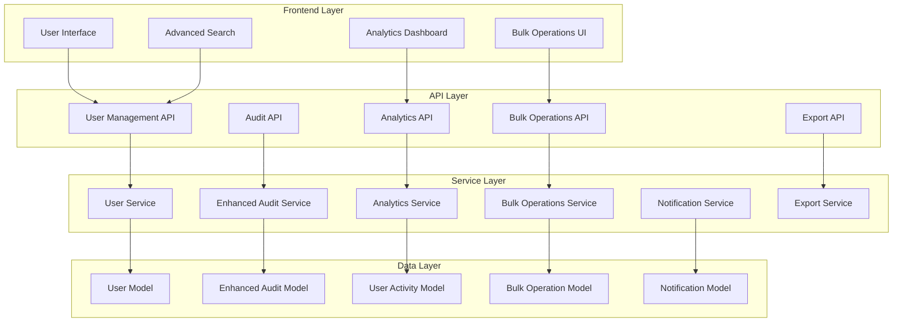
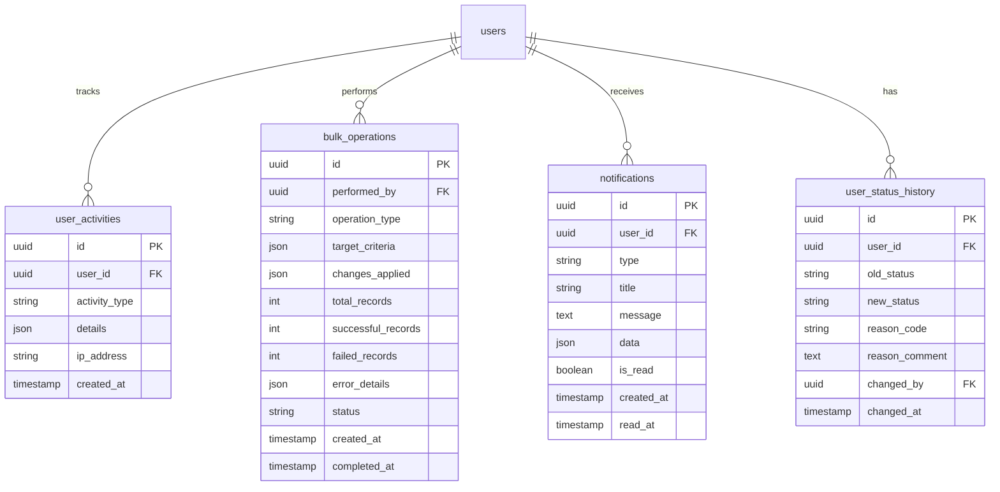

# Design Document

## Overview

This design enhances the existing user management system with enterprise-grade capabilities while maintaining backward compatibility. The current system provides a solid foundation with FastAPI backend, React frontend, PostgreSQL database, and basic audit logging. The enhancements will add bulk operations, comprehensive analytics, advanced search, user lifecycle management, and improved user experience features.

The design follows a modular approach, extending existing components rather than replacing them, ensuring minimal disruption to current functionality while adding powerful new capabilities.

## Architecture

### High-Level Architecture



### Database Schema Extensions

The design extends the existing database schema with new tables and fields:



## Components and Interfaces

### 1. Enhanced User Model

Extends the existing User model with additional fields for lifecycle management:

```python
class User(Base):
    # Existing fields...
    
    # Enhanced status management
    status = Column(String(20), nullable=False, default='pending')  # pending, active, inactive, suspended, archived
    status_reason = Column(String(100))  # Reason for current status
    
    # Activity tracking
    last_activity_at = Column(DateTime(timezone=True))
    login_count = Column(Integer, default=0)
    failed_login_attempts = Column(Integer, default=0)
    
    # Lifecycle management
    onboarding_completed = Column(Boolean, default=False)
    onboarding_completed_at = Column(DateTime(timezone=True))
    offboarding_initiated_at = Column(DateTime(timezone=True))
    offboarding_completed_at = Column(DateTime(timezone=True))
    
    # Preferences
    notification_preferences = Column(JSON)
    ui_preferences = Column(JSON)
```

### 2. Bulk Operations Service

```python
class BulkOperationsService:
    async def bulk_update_status(
        self, 
        user_ids: List[UUID], 
        new_status: str, 
        reason: str,
        performed_by: UUID
    ) -> BulkOperationResult
    
    async def bulk_export_users(
        self, 
        filters: UserFilters, 
        format: str = 'csv',
        columns: List[str] = None
    ) -> ExportResult
    
    async def bulk_import_users(
        self, 
        file_data: bytes, 
        format: str = 'csv',
        performed_by: UUID
    ) -> BulkOperationResult
    
    async def get_bulk_operation_status(
        self, 
        operation_id: UUID
    ) -> BulkOperationStatus
```

### 3. Analytics Service

```python
class AnalyticsService:
    async def get_user_activity_metrics(
        self, 
        date_range: DateRange,
        filters: AnalyticsFilters
    ) -> UserActivityMetrics
    
    async def get_organizational_metrics(
        self, 
        branch_id: Optional[UUID] = None
    ) -> OrganizationalMetrics
    
    async def get_user_lifecycle_metrics(
        self, 
        date_range: DateRange
    ) -> LifecycleMetrics
    
    async def generate_analytics_report(
        self, 
        report_type: str,
        parameters: Dict[str, Any]
    ) -> AnalyticsReport
```

### 4. Enhanced Audit Service

Extends the existing audit service with user management specific features:

```python
class EnhancedAuditService(AuditService):
    async def log_user_activity(
        self,
        user_id: UUID,
        activity_type: str,
        details: Dict[str, Any],
        ip_address: str = None
    ) -> None
    
    async def log_bulk_operation(
        self,
        operation: BulkOperation,
        performed_by: UUID
    ) -> None
    
    async def get_user_audit_trail(
        self,
        user_id: UUID,
        date_range: DateRange = None
    ) -> List[AuditEntry]
    
    async def get_compliance_report(
        self,
        date_range: DateRange,
        report_type: str
    ) -> ComplianceReport
```

### 5. Advanced Search Interface

```typescript
interface AdvancedSearchFilters {
  // Basic filters (existing)
  search?: string;
  role?: string;
  department_id?: string;
  branch_id?: string;
  
  // Enhanced filters
  status?: string[];
  last_login_range?: DateRange;
  created_date_range?: DateRange;
  activity_level?: 'active' | 'inactive' | 'dormant';
  onboarding_status?: 'completed' | 'pending' | 'not_started';
  
  // Advanced criteria
  has_portfolio_manager?: boolean;
  has_line_manager?: boolean;
  login_count_range?: NumberRange;
  
  // Saved searches
  saved_search_id?: string;
}

interface SavedSearch {
  id: string;
  name: string;
  filters: AdvancedSearchFilters;
  created_by: string;
  created_at: Date;
  is_shared: boolean;
}
```

## Data Models

### 1. User Activity Model

```python
class UserActivity(Base):
    __tablename__ = "user_activities"
    
    id = Column(UUID(as_uuid=True), primary_key=True, default=uuid.uuid4)
    user_id = Column(UUID(as_uuid=True), ForeignKey('users.id'), nullable=False)
    activity_type = Column(String(50), nullable=False)  # login, logout, profile_update, password_change
    details = Column(JSON)
    ip_address = Column(String(45))
    user_agent = Column(Text)
    created_at = Column(DateTime(timezone=True), server_default=func.now())
    
    # Relationships
    user = relationship("User", back_populates="activities")
```

### 2. Bulk Operation Model

```python
class BulkOperation(Base):
    __tablename__ = "bulk_operations"
    
    id = Column(UUID(as_uuid=True), primary_key=True, default=uuid.uuid4)
    operation_type = Column(String(50), nullable=False)  # import, export, bulk_update
    performed_by = Column(UUID(as_uuid=True), ForeignKey('users.id'), nullable=False)
    target_criteria = Column(JSON)  # Filters used to select records
    changes_applied = Column(JSON)  # What changes were made
    total_records = Column(Integer, default=0)
    successful_records = Column(Integer, default=0)
    failed_records = Column(Integer, default=0)
    error_details = Column(JSON)
    status = Column(String(20), default='pending')  # pending, processing, completed, failed
    file_path = Column(String(500))  # For import/export files
    created_at = Column(DateTime(timezone=True), server_default=func.now())
    completed_at = Column(DateTime(timezone=True))
    
    # Relationships
    performer = relationship("User", foreign_keys=[performed_by])
```

### 3. User Status History Model

```python
class UserStatusHistory(Base):
    __tablename__ = "user_status_history"
    
    id = Column(UUID(as_uuid=True), primary_key=True, default=uuid.uuid4)
    user_id = Column(UUID(as_uuid=True), ForeignKey('users.id'), nullable=False)
    old_status = Column(String(20))
    new_status = Column(String(20), nullable=False)
    reason_code = Column(String(50))  # promotion, termination, suspension, etc.
    reason_comment = Column(Text)
    changed_by = Column(UUID(as_uuid=True), ForeignKey('users.id'), nullable=False)
    changed_at = Column(DateTime(timezone=True), server_default=func.now())
    
    # Relationships
    user = relationship("User", foreign_keys=[user_id])
    changed_by_user = relationship("User", foreign_keys=[changed_by])
```

### 4. Notification Model

```python
class Notification(Base):
    __tablename__ = "notifications"
    
    id = Column(UUID(as_uuid=True), primary_key=True, default=uuid.uuid4)
    user_id = Column(UUID(as_uuid=True), ForeignKey('users.id'), nullable=False)
    type = Column(String(50), nullable=False)  # user_created, status_changed, bulk_operation_complete
    title = Column(String(200), nullable=False)
    message = Column(Text, nullable=False)
    data = Column(JSON)  # Additional notification data
    is_read = Column(Boolean, default=False)
    created_at = Column(DateTime(timezone=True), server_default=func.now())
    read_at = Column(DateTime(timezone=True))
    
    # Relationships
    user = relationship("User", back_populates="notifications")
```

## Error Handling

### Enhanced Error Response System

```python
class UserManagementError(Exception):
    """Base exception for user management operations"""
    pass

class BulkOperationError(UserManagementError):
    """Exception for bulk operation failures"""
    def __init__(self, message: str, failed_records: List[Dict], successful_count: int = 0):
        self.message = message
        self.failed_records = failed_records
        self.successful_count = successful_count
        super().__init__(message)

class ValidationError(UserManagementError):
    """Enhanced validation error with field-specific details"""
    def __init__(self, field_errors: Dict[str, List[str]]):
        self.field_errors = field_errors
        super().__init__(f"Validation failed for fields: {', '.join(field_errors.keys())}")

# Error response format
{
    "error": {
        "type": "BulkOperationError",
        "message": "Bulk operation partially failed",
        "details": {
            "successful_count": 15,
            "failed_count": 3,
            "failed_records": [
                {
                    "row": 16,
                    "data": {"email": "invalid-email"},
                    "errors": ["Invalid email format"]
                }
            ]
        },
        "suggestions": [
            "Check email format in row 16",
            "Ensure all required fields are provided"
        ]
    }
}
```

## Testing Strategy

### 1. Unit Testing

- **Service Layer Tests**: Test each service method with mocked dependencies
- **Model Tests**: Validate database constraints and relationships
- **Utility Tests**: Test helper functions and data transformations

### 2. Integration Testing

- **API Endpoint Tests**: Test complete request/response cycles
- **Database Integration**: Test complex queries and transactions
- **Bulk Operation Tests**: Test large-scale operations with realistic data

### 3. Performance Testing

- **Load Testing**: Test system performance with high user counts
- **Bulk Operation Performance**: Test import/export with large datasets
- **Analytics Query Performance**: Test dashboard queries with large datasets

### 4. Security Testing

- **Authentication Tests**: Verify role-based access controls
- **Data Sanitization**: Test input validation and SQL injection prevention
- **Audit Trail Integrity**: Verify audit logs cannot be tampered with

### Test Data Strategy

```python
# Test fixtures for different scenarios
@pytest.fixture
def sample_users():
    return [
        {
            "username": f"user{i}",
            "email": f"user{i}@example.com",
            "first_name": f"User{i}",
            "last_name": "Test",
            "role": "officer",
            "status": "active"
        }
        for i in range(100)
    ]

@pytest.fixture
def bulk_operation_data():
    return {
        "operation_type": "bulk_update",
        "target_criteria": {"role": "officer"},
        "changes": {"status": "inactive"},
        "reason": "Department restructuring"
    }
```

### Frontend Testing

```typescript
// Component testing with React Testing Library
describe('BulkOperationsModal', () => {
  test('should validate file format before upload', async () => {
    render(<BulkOperationsModal />);
    
    const fileInput = screen.getByLabelText('Upload CSV file');
    const invalidFile = new File(['invalid'], 'test.txt', { type: 'text/plain' });
    
    fireEvent.change(fileInput, { target: { files: [invalidFile] } });
    
    expect(screen.getByText('Please upload a valid CSV file')).toBeInTheDocument();
  });
  
  test('should show progress during bulk operation', async () => {
    const mockBulkUpdate = jest.fn().mockResolvedValue({ success: true });
    
    render(<BulkOperationsModal onBulkUpdate={mockBulkUpdate} />);
    
    // Simulate bulk operation
    fireEvent.click(screen.getByText('Update Selected Users'));
    
    expect(screen.getByText('Processing...')).toBeInTheDocument();
  });
});
```

## Implementation Phases

### Phase 1: Foundation (Week 1-2)
- Extend database schema with new models
- Enhance existing audit service
- Create basic bulk operations API endpoints
- Add enhanced status management

### Phase 2: Core Features (Week 3-4)
- Implement bulk import/export functionality
- Create analytics service and basic dashboard
- Add advanced search and filtering
- Implement user activity tracking

### Phase 3: User Experience (Week 5-6)
- Build comprehensive frontend components
- Add notification system
- Implement saved searches
- Create user lifecycle workflows

### Phase 4: Advanced Features (Week 7-8)
- Add organizational chart visualization
- Implement advanced analytics and reporting
- Create compliance and audit reports
- Add integration API endpoints

### Phase 5: Polish and Optimization (Week 9-10)
- Performance optimization
- Enhanced error handling and user feedback
- Comprehensive testing
- Documentation and deployment

This design provides a comprehensive enhancement to the existing user management system while maintaining backward compatibility and following established patterns in the codebase.