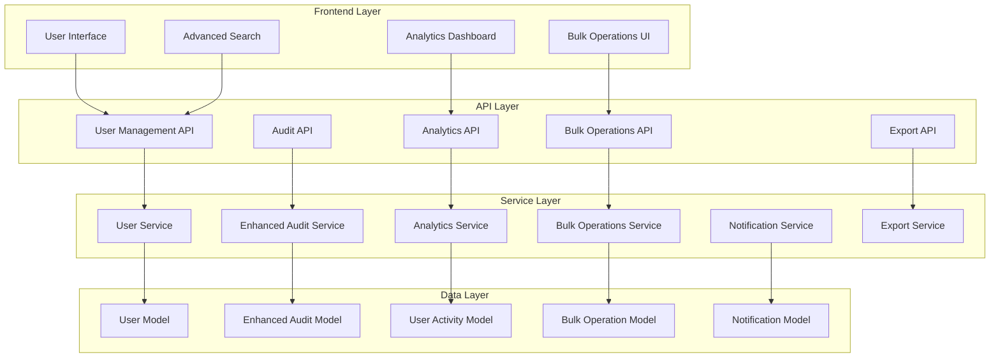
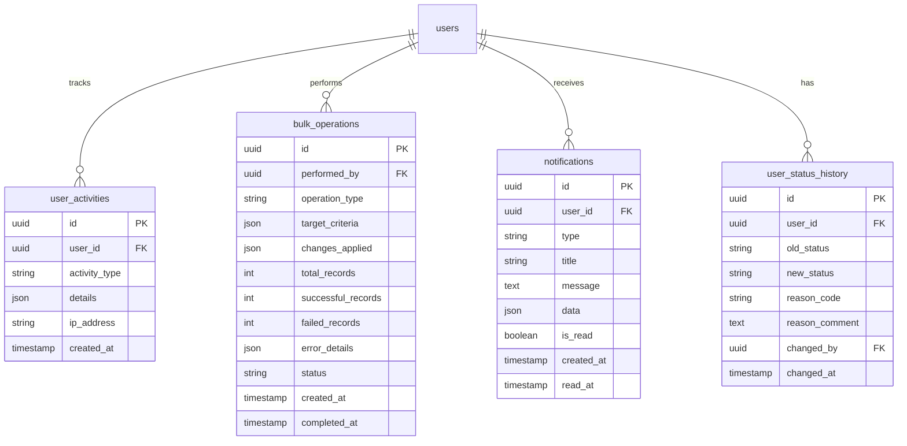

# Design Document

## Overview

This design enhances the existing user management system with enterprise-grade capabilities while maintaining backward compatibility. The current system provides a solid foundation with FastAPI backend, React frontend, PostgreSQL database, and basic audit logging. The enhancements will add bulk operations, comprehensive analytics, advanced search, user lifecycle management, and improved user experience features.

The design follows a modular approach, extending existing components rather than replacing them, ensuring minimal disruption to current functionality while adding powerful new capabilities.

## Architecture

### High-Level Architecture



### Database Schema Extensions

The design extends the existing database schema with new tables and fields:



## Components and Interfaces

### 1. Enhanced User Model

Extends the existing User model with additional fields for lifecycle management:

```python
class User(Base):
    # Existing fields...
    
    # Enhanced status management
    status = Column(String(20), nullable=False, default='pending')  # pending, active, inactive, suspended, archived
    status_reason = Column(String(100))  # Reason for current status
    
    # Activity tracking
    last_activity_at = Column(DateTime(timezone=True))
    login_count = Column(Integer, default=0)
    failed_login_attempts = Column(Integer, default=0)
    
    # Lifecycle management
    onboarding_completed = Column(Boolean, default=False)
    onboarding_completed_at = Column(DateTime(timezone=True))
    offboarding_initiated_at = Column(DateTime(timezone=True))
    offboarding_completed_at = Column(DateTime(timezone=True))
    
    # Preferences
    notification_preferences = Column(JSON)
    ui_preferences = Column(JSON)
```

### 2. Bulk Operations Service

```python
class BulkOperationsService:
    async def bulk_update_status(
        self, 
        user_ids: List[UUID], 
        new_status: str, 
        reason: str,
        performed_by: UUID
    ) -> BulkOperationResult
    
    async def bulk_export_users(
        self, 
        filters: UserFilters, 
        format: str = 'csv',
        columns: List[str] = None
    ) -> ExportResult
    
    async def bulk_import_users(
        self, 
        file_data: bytes, 
        format: str = 'csv',
        performed_by: UUID
    ) -> BulkOperationResult
    
    async def get_bulk_operation_status(
        self, 
        operation_id: UUID
    ) -> BulkOperationStatus
```

### 3. Analytics Service

```python
class AnalyticsService:
    async def get_user_activity_metrics(
        self, 
        date_range: DateRange,
        filters: AnalyticsFilters
    ) -> UserActivityMetrics
    
    async def get_organizational_metrics(
        self, 
        branch_id: Optional[UUID] = None
    ) -> OrganizationalMetrics
    
    async def get_user_lifecycle_metrics(
        self, 
        date_range: DateRange
    ) -> LifecycleMetrics
    
    async def generate_analytics_report(
        self, 
        report_type: str,
        parameters: Dict[str, Any]
    ) -> AnalyticsReport
```

### 4. Enhanced Audit Service

Extends the existing audit service with user management specific features:

```python
class EnhancedAuditService(AuditService):
    async def log_user_activity(
        self,
        user_id: UUID,
        activity_type: str,
        details: Dict[str, Any],
        ip_address: str = None
    ) -> None
    
    async def log_bulk_operation(
        self,
        operation: BulkOperation,
        performed_by: UUID
    ) -> None
    
    async def get_user_audit_trail(
        self,
        user_id: UUID,
        date_range: DateRange = None
    ) -> List[AuditEntry]
    
    async def get_compliance_report(
        self,
        date_range: DateRange,
        report_type: str
    ) -> ComplianceReport
    
    async def export_audit_logs(
        self,
        filters: AuditFilters,
        format: str = 'csv'  # csv, json, pdf
    ) -> ExportResult
    
    async def archive_old_records(
        self,
        retention_days: int,
        archive_location: str
    ) -> ArchiveResult
```

**Design Rationale**: The enhanced audit service addresses requirement 2 (Comprehensive Audit System) by providing detailed activity tracking, filterable audit logs, and multiple export formats. The archive functionality ensures compliance with data retention policies.

### 5. User Lifecycle Service

```python
class UserLifecycleService:
    async def initiate_onboarding(
        self,
        user_id: UUID,
        onboarding_checklist: List[str]
    ) -> OnboardingWorkflow
    
    async def complete_onboarding_step(
        self,
        user_id: UUID,
        step_id: str
    ) -> OnboardingWorkflow
    
    async def send_onboarding_reminder(
        self,
        user_id: UUID
    ) -> None
    
    async def initiate_offboarding(
        self,
        user_id: UUID,
        offboarding_date: datetime,
        data_retention_option: str
    ) -> OffboardingWorkflow
    
    async def complete_offboarding(
        self,
        user_id: UUID
    ) -> None
    
    async def schedule_status_change(
        self,
        user_id: UUID,
        new_status: str,
        scheduled_date: datetime
    ) -> ScheduledStatusChange
    
    async def get_pending_lifecycle_tasks(
        self,
        filters: LifecycleFilters
    ) -> List[LifecycleTask]
```

**Design Rationale**: The lifecycle service directly implements requirement 5 (User Lifecycle Management) by providing structured onboarding/offboarding workflows, status tracking, automated reminders, and scheduled status changes. This ensures proper procedures are followed throughout the user's organizational lifecycle.

### 6. Integration API Service

```python
class IntegrationAPIService:
    async def get_user_data(
        self,
        user_id: UUID,
        api_token: str
    ) -> UserData
    
    async def sync_users(
        self,
        source_system: str,
        sync_config: Dict[str, Any]
    ) -> SyncResult
    
    async def register_webhook(
        self,
        event_types: List[str],
        callback_url: str,
        api_token: str
    ) -> WebhookRegistration
    
    async def import_from_ldap(
        self,
        ldap_config: LDAPConfig,
        mapping: Dict[str, str]
    ) -> ImportResult
    
    async def validate_api_token(
        self,
        token: str
    ) -> TokenValidation
    
    async def check_rate_limit(
        self,
        api_token: str
    ) -> RateLimitStatus
```

**Design Rationale**: The integration API service fulfills requirement 8 (Integration Capabilities) by providing REST API endpoints with authentication, webhook support for real-time synchronization, LDAP integration for enterprise directory services, and rate limiting to prevent abuse.

### 7. Advanced Search Interface

```typescript
interface AdvancedSearchFilters {
  // Basic filters (existing)
  search?: string;
  role?: string;
  department_id?: string;
  branch_id?: string;
  
  // Enhanced filters
  status?: string[];
  last_login_range?: DateRange;
  created_date_range?: DateRange;
  modified_date_range?: DateRange;
  activity_level?: 'active' | 'inactive' | 'dormant';
  onboarding_status?: 'completed' | 'pending' | 'not_started';
  
  // Advanced criteria
  has_portfolio_manager?: boolean;
  has_line_manager?: boolean;
  login_count_range?: NumberRange;
  
  // Logical operators for combining filters
  operator?: 'AND' | 'OR';
  
  // Saved searches
  saved_search_id?: string;
}

interface SavedSearch {
  id: string;
  name: string;
  filters: AdvancedSearchFilters;
  created_by: string;
  created_at: Date;
  is_shared: boolean;
  is_favorite: boolean;
}

interface SearchResult {
  users: User[];
  total_count: number;
  page: number;
  page_size: number;
  sort_by?: string;
  sort_order?: 'asc' | 'desc';
}
```

**Design Rationale**: The advanced search interface supports requirement 4 by providing comprehensive filtering with AND/OR logic, date range filtering for activity tracking, and saved search functionality. The SearchResult interface ensures proper pagination and sorting as specified in the requirements.

### 8. UI/UX Enhancement Components

```typescript
// Progress indicator for long-running operations
interface ProgressIndicator {
  operation_id: string;
  status: 'pending' | 'processing' | 'completed' | 'failed';
  progress_percentage: number;
  current_step: string;
  estimated_time_remaining?: number;
}

// Enhanced form validation
interface ValidationResult {
  is_valid: boolean;
  field_errors: Record<string, string[]>;
  suggestions: Record<string, string>;
  corrected_values?: Record<string, any>;
}

// Success confirmation with next steps
interface OperationSuccess {
  message: string;
  details: Record<string, any>;
  next_steps: Array<{
    label: string;
    action: string;
    is_primary: boolean;
  }>;
  related_resources?: Array<{
    type: string;
    id: string;
    label: string;
  }>;
}

// Responsive design breakpoints
const BREAKPOINTS = {
  mobile: '320px',
  tablet: '768px',
  desktop: '1024px',
  wide: '1440px'
};
```

**Design Rationale**: These UI/UX components address requirement 7 (Improved User Experience) by providing clear progress indicators for operations exceeding 2 seconds, specific validation feedback with suggestions, success confirmations with actionable next steps, and responsive design support for mobile devices. The design ensures users always understand system state and have clear paths forward.

## Data Models

### 1. User Activity Model

```python
class UserActivity(Base):
    __tablename__ = "user_activities"
    
    id = Column(UUID(as_uuid=True), primary_key=True, default=uuid.uuid4)
    user_id = Column(UUID(as_uuid=True), ForeignKey('users.id'), nullable=False)
    activity_type = Column(String(50), nullable=False)  # login, logout, profile_update, password_change
    details = Column(JSON)
    ip_address = Column(String(45))
    user_agent = Column(Text)
    created_at = Column(DateTime(timezone=True), server_default=func.now())
    
    # Relationships
    user = relationship("User", back_populates="activities")
```

### 2. Bulk Operation Model

```python
class BulkOperation(Base):
    __tablename__ = "bulk_operations"
    
    id = Column(UUID(as_uuid=True), primary_key=True, default=uuid.uuid4)
    operation_type = Column(String(50), nullable=False)  # import, export, bulk_update
    performed_by = Column(UUID(as_uuid=True), ForeignKey('users.id'), nullable=False)
    target_criteria = Column(JSON)  # Filters used to select records
    changes_applied = Column(JSON)  # What changes were made
    total_records = Column(Integer, default=0)
    successful_records = Column(Integer, default=0)
    failed_records = Column(Integer, default=0)
    error_details = Column(JSON)
    status = Column(String(20), default='pending')  # pending, processing, completed, failed
    file_path = Column(String(500))  # For import/export files
    created_at = Column(DateTime(timezone=True), server_default=func.now())
    completed_at = Column(DateTime(timezone=True))
    
    # Relationships
    performer = relationship("User", foreign_keys=[performed_by])
```

### 3. User Status History Model

```python
class UserStatusHistory(Base):
    __tablename__ = "user_status_history"
    
    id = Column(UUID(as_uuid=True), primary_key=True, default=uuid.uuid4)
    user_id = Column(UUID(as_uuid=True), ForeignKey('users.id'), nullable=False)
    old_status = Column(String(20))
    new_status = Column(String(20), nullable=False)
    reason_code = Column(String(50))  # promotion, termination, suspension, etc.
    reason_comment = Column(Text)
    changed_by = Column(UUID(as_uuid=True), ForeignKey('users.id'), nullable=False)
    changed_at = Column(DateTime(timezone=True), server_default=func.now())
    
    # Relationships
    user = relationship("User", foreign_keys=[user_id])
    changed_by_user = relationship("User", foreign_keys=[changed_by])
```

### 4. Notification Model

```python
class Notification(Base):
    __tablename__ = "notifications"
    
    id = Column(UUID(as_uuid=True), primary_key=True, default=uuid.uuid4)
    user_id = Column(UUID(as_uuid=True), ForeignKey('users.id'), nullable=False)
    type = Column(String(50), nullable=False)  # user_created, status_changed, bulk_operation_complete, onboarding_reminder
    title = Column(String(200), nullable=False)
    message = Column(Text, nullable=False)
    data = Column(JSON)  # Additional notification data
    is_read = Column(Boolean, default=False)
    priority = Column(String(20), default='normal')  # low, normal, high, urgent
    created_at = Column(DateTime(timezone=True), server_default=func.now())
    read_at = Column(DateTime(timezone=True))
    
    # Relationships
    user = relationship("User", back_populates="notifications")
```

**Design Rationale**: The notification model supports requirement 5 (User Lifecycle Management) by enabling automated notifications for lifecycle events. The priority field allows for proper escalation of important notifications like pending onboarding tasks or status changes requiring attention.

### 5. Onboarding Workflow Model

```python
class OnboardingWorkflow(Base):
    __tablename__ = "onboarding_workflows"
    
    id = Column(UUID(as_uuid=True), primary_key=True, default=uuid.uuid4)
    user_id = Column(UUID(as_uuid=True), ForeignKey('users.id'), nullable=False, unique=True)
    status = Column(String(20), default='not_started')  # not_started, in_progress, completed
    checklist = Column(JSON)  # List of onboarding tasks with completion status
    started_at = Column(DateTime(timezone=True))
    completed_at = Column(DateTime(timezone=True))
    last_reminder_sent_at = Column(DateTime(timezone=True))
    assigned_mentor_id = Column(UUID(as_uuid=True), ForeignKey('users.id'))
    
    # Relationships
    user = relationship("User", foreign_keys=[user_id], back_populates="onboarding_workflow")
    assigned_mentor = relationship("User", foreign_keys=[assigned_mentor_id])
```

### 6. Offboarding Workflow Model

```python
class OffboardingWorkflow(Base):
    __tablename__ = "offboarding_workflows"
    
    id = Column(UUID(as_uuid=True), primary_key=True, default=uuid.uuid4)
    user_id = Column(UUID(as_uuid=True), ForeignKey('users.id'), nullable=False, unique=True)
    status = Column(String(20), default='not_started')  # not_started, in_progress, completed
    checklist = Column(JSON)  # List of offboarding tasks
    data_retention_option = Column(String(50))  # archive, delete_after_period, transfer
    scheduled_date = Column(DateTime(timezone=True))
    initiated_at = Column(DateTime(timezone=True))
    completed_at = Column(DateTime(timezone=True))
    initiated_by = Column(UUID(as_uuid=True), ForeignKey('users.id'))
    
    # Relationships
    user = relationship("User", foreign_keys=[user_id])
    initiator = relationship("User", foreign_keys=[initiated_by])
```

### 7. Saved Search Model

```python
class SavedSearch(Base):
    __tablename__ = "saved_searches"
    
    id = Column(UUID(as_uuid=True), primary_key=True, default=uuid.uuid4)
    name = Column(String(100), nullable=False)
    filters = Column(JSON, nullable=False)  # Serialized search filters
    created_by = Column(UUID(as_uuid=True), ForeignKey('users.id'), nullable=False)
    created_at = Column(DateTime(timezone=True), server_default=func.now())
    updated_at = Column(DateTime(timezone=True), onupdate=func.now())
    is_shared = Column(Boolean, default=False)
    is_favorite = Column(Boolean, default=False)
    usage_count = Column(Integer, default=0)
    last_used_at = Column(DateTime(timezone=True))
    
    # Relationships
    creator = relationship("User", back_populates="saved_searches")
```

### 8. Scheduled Status Change Model

```python
class ScheduledStatusChange(Base):
    __tablename__ = "scheduled_status_changes"
    
    id = Column(UUID(as_uuid=True), primary_key=True, default=uuid.uuid4)
    user_id = Column(UUID(as_uuid=True), ForeignKey('users.id'), nullable=False)
    current_status = Column(String(20), nullable=False)
    target_status = Column(String(20), nullable=False)
    scheduled_date = Column(DateTime(timezone=True), nullable=False)
    reason = Column(Text)
    created_by = Column(UUID(as_uuid=True), ForeignKey('users.id'), nullable=False)
    created_at = Column(DateTime(timezone=True), server_default=func.now())
    executed_at = Column(DateTime(timezone=True))
    status = Column(String(20), default='pending')  # pending, executed, cancelled
    
    # Relationships
    user = relationship("User", foreign_keys=[user_id])
    scheduler = relationship("User", foreign_keys=[created_by])
```

**Design Rationale**: These additional models support requirement 5 (User Lifecycle Management) by providing structured workflows for onboarding and offboarding with checklist tracking and automated reminders. The SavedSearch model addresses requirement 4 (Advanced Search and Filtering) by allowing users to save and reuse complex filter combinations. The ScheduledStatusChange model enables temporal status management as specified in requirement 5.

## Status Management

### Status Transition Rules

```python
# Valid status transitions
STATUS_TRANSITIONS = {
    'pending': ['active', 'inactive'],
    'active': ['inactive', 'suspended', 'archived'],
    'inactive': ['active', 'archived'],
    'suspended': ['active', 'inactive', 'archived'],
    'archived': []  # Terminal state, no transitions allowed
}

# Reason codes for status changes
REASON_CODES = {
    'promotion': 'User promoted to new role',
    'termination': 'Employment terminated',
    'suspension': 'Account suspended due to policy violation',
    'leave': 'User on extended leave',
    'completion': 'Onboarding completed',
    'restructuring': 'Organizational restructuring',
    'retirement': 'User retired',
    'transfer': 'Transferred to different department'
}

class StatusManager:
    def validate_transition(
        self, 
        current_status: str, 
        target_status: str
    ) -> Tuple[bool, Optional[str]]:
        """
        Validate if status transition is allowed
        Returns: (is_valid, error_message)
        """
        if target_status not in STATUS_TRANSITIONS.get(current_status, []):
            allowed = STATUS_TRANSITIONS.get(current_status, [])
            return False, f"Cannot transition from {current_status} to {target_status}. Allowed: {allowed}"
        return True, None
    
    async def change_status(
        self,
        user_id: UUID,
        new_status: str,
        reason_code: str,
        reason_comment: Optional[str],
        changed_by: UUID
    ) -> StatusChangeResult:
        """
        Change user status with validation and audit logging
        """
        # Validate transition
        # Update user status
        # Log to status history
        # Trigger notifications
        # Update permissions if needed
        pass
```

**Design Rationale**: The status management system implements requirement 6 (Enhanced Status Management) by enforcing valid state transitions through a state machine pattern. The reason codes provide standardized documentation for status changes, supporting audit requirements. The StatusManager encapsulates all business rules and ensures consistency across the application.

## Error Handling

### Enhanced Error Response System

```python
class UserManagementError(Exception):
    """Base exception for user management operations"""
    pass

class BulkOperationError(UserManagementError):
    """Exception for bulk operation failures"""
    def __init__(self, message: str, failed_records: List[Dict], successful_count: int = 0):
        self.message = message
        self.failed_records = failed_records
        self.successful_count = successful_count
        super().__init__(message)

class ValidationError(UserManagementError):
    """Enhanced validation error with field-specific details"""
    def __init__(self, field_errors: Dict[str, List[str]]):
        self.field_errors = field_errors
        super().__init__(f"Validation failed for fields: {', '.join(field_errors.keys())}")

class StatusTransitionError(UserManagementError):
    """Exception for invalid status transitions"""
    def __init__(self, current_status: str, target_status: str, allowed_transitions: List[str]):
        self.current_status = current_status
        self.target_status = target_status
        self.allowed_transitions = allowed_transitions
        super().__init__(f"Cannot transition from {current_status} to {target_status}")

class IntegrationError(UserManagementError):
    """Exception for external system integration failures"""
    def __init__(self, system: str, operation: str, details: Dict[str, Any]):
        self.system = system
        self.operation = operation
        self.details = details
        super().__init__(f"Integration error with {system} during {operation}")

# Error response format
{
    "error": {
        "type": "BulkOperationError",
        "message": "Bulk operation partially failed",
        "details": {
            "successful_count": 15,
            "failed_count": 3,
            "failed_records": [
                {
                    "row": 16,
                    "data": {"email": "invalid-email"},
                    "errors": ["Invalid email format"]
                }
            ]
        },
        "suggestions": [
            "Check email format in row 16",
            "Ensure all required fields are provided"
        ],
        "retry_available": true,
        "next_steps": [
            "Fix the errors in the failed records",
            "Re-upload the corrected file"
        ]
    }
}
```

**Design Rationale**: The enhanced error handling system addresses requirement 7 (Improved User Experience) by providing specific, actionable error messages with suggestions for correction. The addition of StatusTransitionError supports requirement 6 (Enhanced Status Management) by enforcing valid state transitions. IntegrationError supports requirement 8 (Integration Capabilities) by providing detailed feedback for external system failures. The retry_available and next_steps fields guide users toward resolution.

## API Endpoints

### User Management Endpoints (Enhanced)

```python
# Existing endpoints remain unchanged, new endpoints added:

# Bulk Operations
POST   /api/v1/users/bulk/import          # Import users from CSV/JSON
POST   /api/v1/users/bulk/export          # Export users with filters
POST   /api/v1/users/bulk/update-status   # Update status for multiple users
GET    /api/v1/users/bulk/operations/{id} # Get bulk operation status

# Analytics
GET    /api/v1/users/analytics/activity-metrics      # User activity metrics
GET    /api/v1/users/analytics/organizational        # Organizational breakdown
GET    /api/v1/users/analytics/lifecycle             # Lifecycle metrics
POST   /api/v1/users/analytics/reports               # Generate custom reports

# Advanced Search
POST   /api/v1/users/search/advanced                 # Advanced search with filters
GET    /api/v1/users/search/saved                    # List saved searches
POST   /api/v1/users/search/saved                    # Create saved search
PUT    /api/v1/users/search/saved/{id}               # Update saved search
DELETE /api/v1/users/search/saved/{id}               # Delete saved search

# Lifecycle Management
POST   /api/v1/users/{id}/onboarding/initiate        # Start onboarding
PUT    /api/v1/users/{id}/onboarding/complete-step   # Complete onboarding step
POST   /api/v1/users/{id}/offboarding/initiate       # Start offboarding
PUT    /api/v1/users/{id}/offboarding/complete       # Complete offboarding
GET    /api/v1/users/lifecycle/pending-tasks         # Get pending lifecycle tasks

# Status Management
PUT    /api/v1/users/{id}/status                     # Update user status with reason
POST   /api/v1/users/{id}/status/schedule            # Schedule status change
GET    /api/v1/users/{id}/status/history             # Get status change history

# Audit
GET    /api/v1/users/{id}/audit-trail                # Get user audit trail
POST   /api/v1/users/audit/export                    # Export audit logs
GET    /api/v1/users/audit/compliance-report         # Generate compliance report

# Integration API (External)
GET    /api/external/v1/users                        # List users (with API token)
GET    /api/external/v1/users/{id}                   # Get user details
POST   /api/external/v1/webhooks                     # Register webhook
DELETE /api/external/v1/webhooks/{id}                # Unregister webhook
POST   /api/external/v1/sync/ldap                    # Sync from LDAP
```

### Authentication and Rate Limiting

```python
# API Token Authentication
class APITokenAuth:
    def __init__(self, token: str):
        self.token = token
        self.rate_limit = 1000  # requests per hour
        self.current_usage = 0
    
    async def validate(self) -> bool:
        # Validate token and check rate limit
        pass

# Rate Limiting Configuration
RATE_LIMITS = {
    'default': 100,      # requests per minute
    'bulk_operations': 10,
    'analytics': 50,
    'external_api': 1000  # per hour
}
```

**Design Rationale**: The API endpoints provide comprehensive access to all enhanced features while maintaining RESTful conventions. The external API endpoints support requirement 8 (Integration Capabilities) with proper authentication and rate limiting. Bulk operation endpoints address requirement 1, analytics endpoints support requirement 3, and lifecycle endpoints implement requirement 5.

## Testing Strategy

### 1. Unit Testing

- **Service Layer Tests**: Test each service method with mocked dependencies
- **Model Tests**: Validate database constraints and relationships
- **Utility Tests**: Test helper functions and data transformations

### 2. Integration Testing

- **API Endpoint Tests**: Test complete request/response cycles
- **Database Integration**: Test complex queries and transactions
- **Bulk Operation Tests**: Test large-scale operations with realistic data

### 3. Performance Testing

- **Load Testing**: Test system performance with high user counts
- **Bulk Operation Performance**: Test import/export with large datasets
- **Analytics Query Performance**: Test dashboard queries with large datasets

### 4. Security Testing

- **Authentication Tests**: Verify role-based access controls
- **Data Sanitization**: Test input validation and SQL injection prevention
- **Audit Trail Integrity**: Verify audit logs cannot be tampered with

### Test Data Strategy

```python
# Test fixtures for different scenarios
@pytest.fixture
def sample_users():
    return [
        {
            "username": f"user{i}",
            "email": f"user{i}@example.com",
            "first_name": f"User{i}",
            "last_name": "Test",
            "role": "officer",
            "status": "active"
        }
        for i in range(100)
    ]

@pytest.fixture
def bulk_operation_data():
    return {
        "operation_type": "bulk_update",
        "target_criteria": {"role": "officer"},
        "changes": {"status": "inactive"},
        "reason": "Department restructuring"
    }
```

### Frontend Testing

```typescript
// Component testing with React Testing Library
describe('BulkOperationsModal', () => {
  test('should validate file format before upload', async () => {
    render(<BulkOperationsModal />);
    
    const fileInput = screen.getByLabelText('Upload CSV file');
    const invalidFile = new File(['invalid'], 'test.txt', { type: 'text/plain' });
    
    fireEvent.change(fileInput, { target: { files: [invalidFile] } });
    
    expect(screen.getByText('Please upload a valid CSV file')).toBeInTheDocument();
  });
  
  test('should show progress during bulk operation', async () => {
    const mockBulkUpdate = jest.fn().mockResolvedValue({ success: true });
    
    render(<BulkOperationsModal onBulkUpdate={mockBulkUpdate} />);
    
    // Simulate bulk operation
    fireEvent.click(screen.getByText('Update Selected Users'));
    
    expect(screen.getByText('Processing...')).toBeInTheDocument();
  });
});
```

## Implementation Phases

### Phase 1: Foundation (Week 1-2)
- Extend database schema with new models
- Enhance existing audit service
- Create basic bulk operations API endpoints
- Add enhanced status management

### Phase 2: Core Features (Week 3-4)
- Implement bulk import/export functionality
- Create analytics service and basic dashboard
- Add advanced search and filtering
- Implement user activity tracking

### Phase 3: User Experience (Week 5-6)
- Build comprehensive frontend components
- Add notification system
- Implement saved searches
- Create user lifecycle workflows

### Phase 4: Advanced Features (Week 7-8)
- Add organizational chart visualization
- Implement advanced analytics and reporting
- Create compliance and audit reports
- Add integration API endpoints

### Phase 5: Polish and Optimization (Week 9-10)
- Performance optimization
- Enhanced error handling and user feedback
- Comprehensive testing
- Documentation and deployment

This design provides a comprehensive enhancement to the existing user management system while maintaining backward compatibility and following established patterns in the codebase.