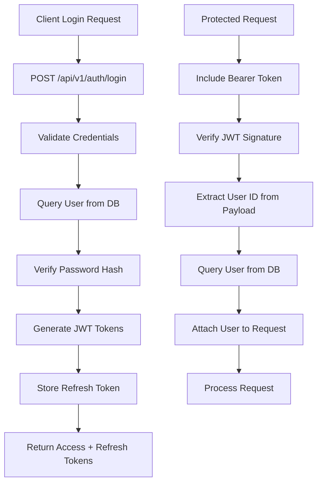
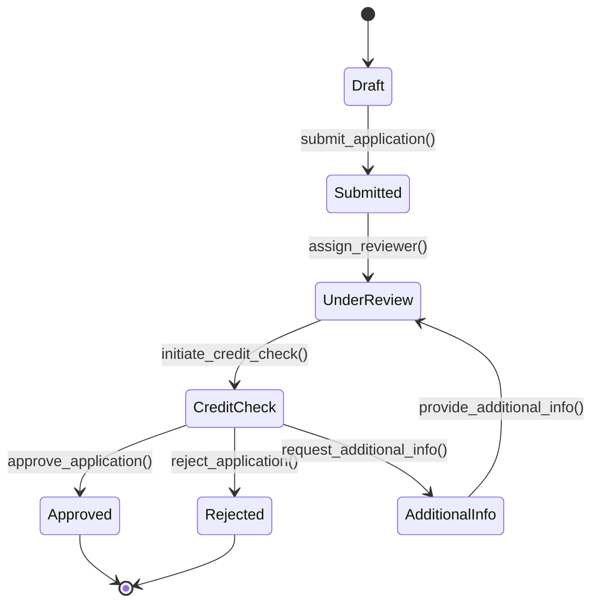

# LC Workflow Backend - Data Flow Documentation

## Overview
This document provides a comprehensive explanation of how data flows through the LC Workflow backend system, detailing the journey of information from client requests to database storage and back to client responses.

## 1. Request Processing Pipeline

### 1.1 HTTP Request Lifecycle

```
Client Request → FastAPI Router → Authentication → Authorization → Business Logic → Database → Response
```

**Detailed Flow:**
1. **Client Request**: HTTP request arrives with headers, body, and authentication token
2. **FastAPI Router**: Route matching based on URL patterns defined in `main.py`
3. **Authentication**: JWT token validation via `get_current_user()` dependency
4. **Authorization**: Permission checking based on user roles and resource ownership
5. **Business Logic**: Service layer processing (validation, transformation, business rules)
6. **Database**: CRUD operations via SQLAlchemy ORM
7. **Response**: Data serialization using Pydantic models and JSON response

### 1.2 Authentication Data Flow



## 2. Customer Application Data Flow

### 2.1 Application Creation Process

**Data Transformation Stages:**

1. **Client Input** → Pydantic Validation → Database Model → SQLAlchemy ORM

```python
# Client JSON Input
{
  "borrower_info": {
    "full_name": "John Doe",
    "date_of_birth": "1990-01-15",
    "phone_number": "+1234567890"
  },
  "loan_details": {
    "loan_amount": 50000,
    "loan_purpose": "Home Purchase",
    "loan_term": 360
  }
}

# Pydantic Validation (schemas.py)
class CustomerApplicationCreate(CustomerApplicationBase):
    borrower_info: BorrowerInfo
    loan_details: LoanDetails
    
# Database Model (models.py)
class CustomerApplication(Base):
    id = Column(UUID, primary_key=True)
    borrower_info = Column(JSONB)  # JSONB storage
    loan_details = Column(JSONB)
    status = Column(String, default="draft")
    created_at = Column(DateTime, default=datetime.utcnow)
```

### 2.2 File Upload Data Flow

#### Direct Upload
```
Binary File → Multipart Form → FastAPI UploadFile → MinIO Storage → Database Record → Response URL
```

#### Presigned URL Upload
```
Request Upload URL → Generate Presigned URL → Client Uploads Directly → Finalize Upload → Database Record
```

### 2.3 Application Status Transitions



## 3. Database Relationships and Data Propagation

### 3.1 Entity Relationship Data Flow

```
User (1) ----< (N) CustomerApplication
User (1) ----< (N) File
Department (1) ----< (N) User
Branch (1) ----< (N) User
CustomerApplication (1) ----< (N) File
```

**Cascade Operations:**
- When a User is deleted: Files remain, applications maintain user_id reference
- When a CustomerApplication is deleted: All associated files are deleted from MinIO and database
- When a Department/Branch is deleted: Users maintain their department/branch_id as nullable

### 3.2 Data Consistency Patterns

#### Transactional Operations
```python
# Example: Creating application with files
async def create_application_with_files(app_data, files):
    async with db.begin() as transaction:
        # 1. Create application record
        application = CustomerApplication(**app_data)
        db.add(application)
        await db.flush()  # Get application ID
        
        # 2. Upload files to MinIO
        file_records = []
        for file in files:
            file_path = await minio_service.upload_file(file)
            file_record = File(
                filename=file.filename,
                path=file_path,
                application_id=application.id
            )
            file_records.append(file_record)
        
        # 3. Create file records in database
        db.add_all(file_records)
        
        # 4. Commit transaction (all or nothing)
        await transaction.commit()
```

## 4. File Storage Data Flow

### 4.1 MinIO Storage Structure

```
Bucket: lc-workflow-files
├── applications/
│   ├── {application_id}/
│   │   ├── borrower-docs/
│   │   │   ├── {file_uuid}_id_proof.pdf
│   │   │   ├── {file_uuid}_income_proof.pdf
│   │   ├── property-docs/
│   │   └── guarantor-docs/
├── user-avatars/
│   └── {user_id}/
└── templates/
    └── {template_type}/
```

### 4.2 File Metadata Synchronization

**Database Record:**
```sql
CREATE TABLE files (
    id UUID PRIMARY KEY,
    filename VARCHAR(255),
    path VARCHAR(500),
    size BIGINT,
    content_type VARCHAR(100),
    application_id UUID REFERENCES customer_applications(id),
    user_id UUID REFERENCES users(id),
    created_at TIMESTAMP DEFAULT NOW()
);
```

**MinIO Metadata:**
```json
{
  "filename": "original_filename.pdf",
  "content_type": "application/pdf",
  "size": 1048576,
  "application_id": "uuid",
  "user_id": "uuid"
}
```

## 5. Search and Filtering Data Flow

### 5.1 Application Search Process

```python
# Client Request: GET /api/v1/applications?status=submitted&branch_id=123&page=1&size=20

# 1. Query Parameters Processing
filters = {
    "status": "submitted",
    "branch_id": "123",
    "date_from": "2024-01-01",
    "date_to": "2024-12-31"
}

# 2. SQL Query Generation
query = select(CustomerApplication).where(
    CustomerApplication.status == filters["status"],
    CustomerApplication.branch_id == filters["branch_id"],
    CustomerApplication.created_at.between(filters["date_from"], filters["date_to"])
)

# 3. Pagination
offset = (page - 1) * size
query = query.offset(offset).limit(size)

# 4. Data Enrichment
applications = await db.execute(query)
enriched_data = [
    {
        **app.dict(),
        "file_count": await get_file_count(app.id),
        "reviewer": await get_user_info(app.reviewer_id)
    }
    for app in applications
]
```

### 5.2 Full-Text Search Implementation

```sql
-- PostgreSQL full-text search on JSONB fields
CREATE INDEX idx_application_search ON customer_applications 
USING gin(to_tsvector('english', 
    borrower_info->>'full_name' || ' ' || 
    loan_details->>'loan_purpose' || ' ' || 
    address->>'street_address'
));

-- Query example
SELECT * FROM customer_applications 
WHERE to_tsvector('english', borrower_info->>'full_name') @@ plainto_tsquery('john doe');
```

## 6. Real-time Data Synchronization

### 6.1 WebSocket Event Flow

```python
# Event Types
class ApplicationEvents:
    STATUS_CHANGED = "application_status_changed"
    FILE_UPLOADED = "file_uploaded"
    REVIEW_ASSIGNED = "review_assigned"
    COMMENT_ADDED = "comment_added"

# Event Broadcasting
async def broadcast_application_update(application_id, event_type, data):
    message = {
        "type": event_type,
        "application_id": application_id,
        "data": data,
        "timestamp": datetime.utcnow().isoformat()
    }
    
    # Send to all connected clients with access to this application
    for connection in active_connections:
        if can_access_application(connection.user_id, application_id):
            await connection.send_json(message)
```

### 6.2 Cache Invalidation Strategy

```python
# Redis cache keys
CACHE_KEYS = {
    "user_profile": "user:{user_id}:profile",
    "application_list": "user:{user_id}:applications:{page}:{size}",
    "file_metadata": "file:{file_id}:metadata",
    "department_stats": "dept:{dept_id}:stats"
}

# Cache invalidation triggers
async def invalidate_application_cache(application_id):
    keys_to_invalidate = [
        f"application:{application_id}",
        f"user:*:applications:*",  # Pattern matching
        f"dept:*:stats"
    ]
    await redis.delete(*keys_to_invalidate)
```

## 7. Data Validation and Sanitization

### 7.1 Input Validation Pipeline

```python
# Pydantic Models (schemas.py)
class CustomerApplicationCreate(BaseModel):
    borrower_info: BorrowerInfo
    loan_details: LoanDetails
    
    @validator('borrower_info')
    def validate_borrower_info(cls, v):
        if not v.full_name or len(v.full_name) < 2:
            raise ValueError("Full name must be at least 2 characters")
        return v
    
    @validator('loan_details')
    def validate_loan_amount(cls, v):
        if v.loan_amount <= 0:
            raise ValueError("Loan amount must be positive")
        return v

# Business Logic Validation
async def validate_application_business_rules(application_data):
    # Check loan-to-income ratio
    income = application_data.borrower_info.monthly_income
    loan_amount = application_data.loan_details.loan_amount
    
    if loan_amount > income * 36:  # 3x annual income
        raise BusinessRuleViolation("Loan amount exceeds maximum allowed")
    
    # Check age requirements
    age = calculate_age(application_data.borrower_info.date_of_birth)
    if age < 21 or age > 65:
        raise BusinessRuleViolation("Age must be between 21 and 65")
```

### 7.2 Data Sanitization

```python
# Sanitization functions
def sanitize_phone_number(phone: str) -> str:
    # Remove non-numeric characters
    cleaned = re.sub(r'[^\d+]', '', phone)
    # Ensure proper format
    if not cleaned.startswith('+'):
        cleaned = f"+{cleaned}"
    return cleaned

def sanitize_address(address: dict) -> dict:
    # Remove extra whitespace
    return {
        key: re.sub(r'\s+', ' ', value.strip())
        for key, value in address.items()
    }
```

## 8. Audit Trail and Data Lineage

### 8.1 Audit Log Structure

```sql
CREATE TABLE audit_logs (
    id UUID PRIMARY KEY,
    table_name VARCHAR(100),
    record_id UUID,
    action VARCHAR(50), -- CREATE, UPDATE, DELETE
    old_values JSONB,
    new_values JSONB,
    user_id UUID REFERENCES users(id),
    timestamp TIMESTAMP DEFAULT NOW(),
    ip_address INET,
    user_agent TEXT
);
```

### 8.2 Data Lineage Tracking

```python
# Track changes to application data
class ApplicationAudit:
    def __init__(self, application_id):
        self.application_id = application_id
    
    async def log_change(self, field_name, old_value, new_value, user_id):
        await db.execute(
            insert(audit_logs).values(
                table_name="customer_applications",
                record_id=self.application_id,
                action="UPDATE",
                old_values={field_name: old_value},
                new_values={field_name: new_value},
                user_id=user_id
            )
        )
```

## 9. Performance Optimization Data Flow

### 9.1 Query Optimization

```python
# Eager loading to prevent N+1 queries
async def get_application_with_files(application_id):
    query = (
        select(CustomerApplication)
        .options(
            selectinload(CustomerApplication.files),
            selectinload(CustomerApplication.user),
            selectinload(CustomerApplication.reviewer)
        )
        .where(CustomerApplication.id == application_id)
    )
    return await db.execute(query)

# Database indexes
CREATE INDEX idx_application_status_branch ON customer_applications(status, branch_id);
CREATE INDEX idx_files_application_user ON files(application_id, user_id);
CREATE INDEX idx_users_department ON users(department_id) WHERE department_id IS NOT NULL;
```

### 9.2 Pagination Strategy

```python
# Cursor-based pagination for large datasets
async def get_applications_cursor(cursor=None, limit=20):
    query = select(CustomerApplication)
    
    if cursor:
        query = query.where(CustomerApplication.id > cursor)
    
    query = query.order_by(CustomerApplication.id).limit(limit + 1)
    
    results = await db.execute(query)
    applications = results.scalars().all()
    
    has_more = len(applications) > limit
    if has_more:
        applications = applications[:-1]
        next_cursor = applications[-1].id
    else:
        next_cursor = None
    
    return {
        "items": applications,
        "next_cursor": next_cursor,
        "has_more": has_more
    }
```

## 10. Security Data Flow

### 10.1 Encryption at Rest

```python
# Sensitive field encryption
class EncryptedType(TypeDecorator):
    impl = String
    
    def process_bind_param(self, value, dialect):
        if value is not None:
            return encrypt_value(value)
        return value
    
    def process_result_value(self, value, dialect):
        if value is not None:
            return decrypt_value(value)
        return value

# Usage in models
class CustomerApplication(Base):
    ssn = Column(EncryptedType)  # Automatically encrypted/decrypted
    bank_account = Column(EncryptedType)
```

### 10.2 Rate Limiting

```python
# Redis-based rate limiting
async def check_rate_limit(user_id, endpoint):
    key = f"rate_limit:{user_id}:{endpoint}"
    current = await redis.incr(key)
    
    if current == 1:
        await redis.expire(key, 3600)  # 1 hour window
    
    if current > 100:  # 100 requests per hour
        raise RateLimitExceeded()
```

This comprehensive data flow documentation covers all aspects of how data moves through the LC Workflow backend system, from initial client requests to final storage and retrieval, including security, performance, and consistency considerations.