# LC Workflow Backend - Detailed Sequence Diagrams

## 1. Complete User Authentication Flow

### User Registration and Login

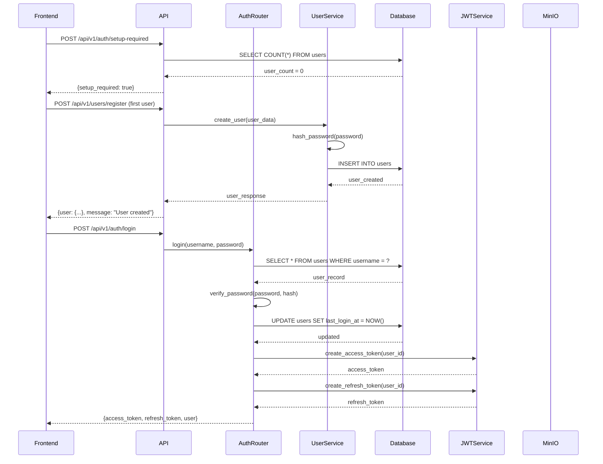

## 2. File Upload with Authorization Check

### Direct File Upload Flow

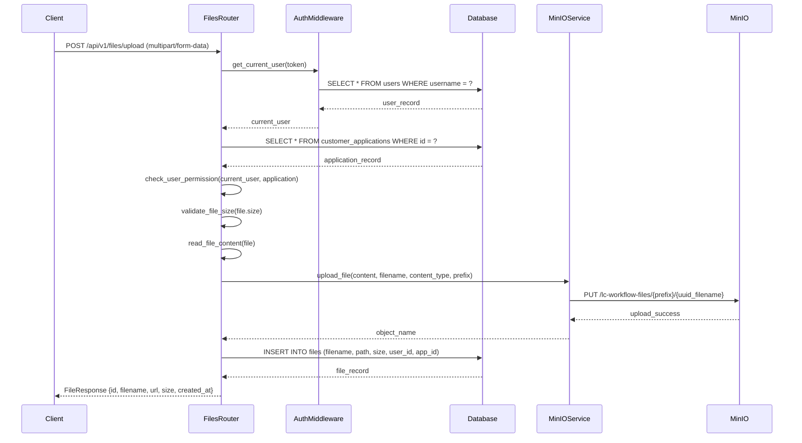

### Presigned URL Upload Flow

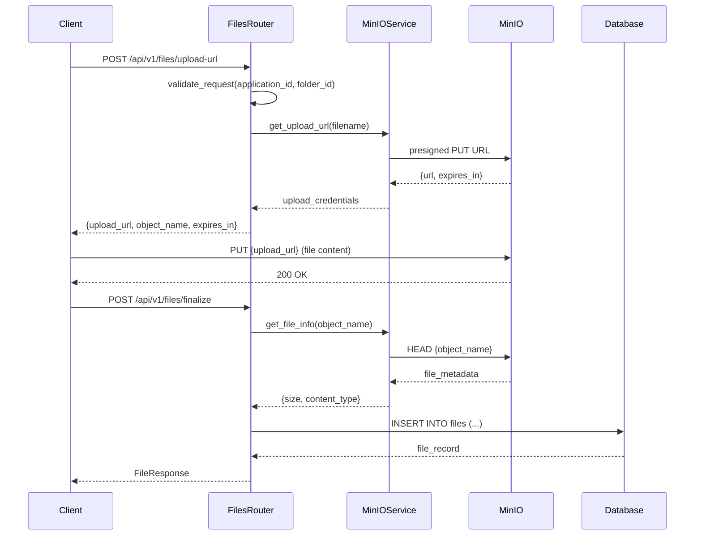

## 3. Customer Application Processing

### Application Creation Flow

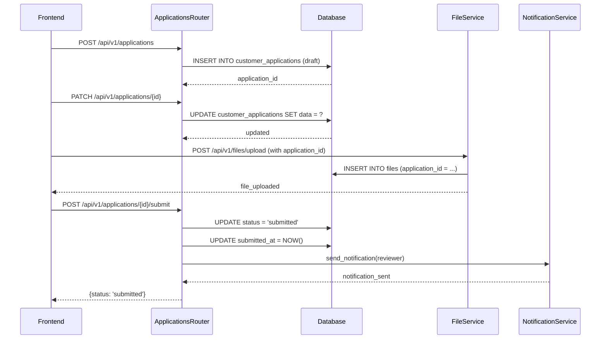

### Application Review Workflow

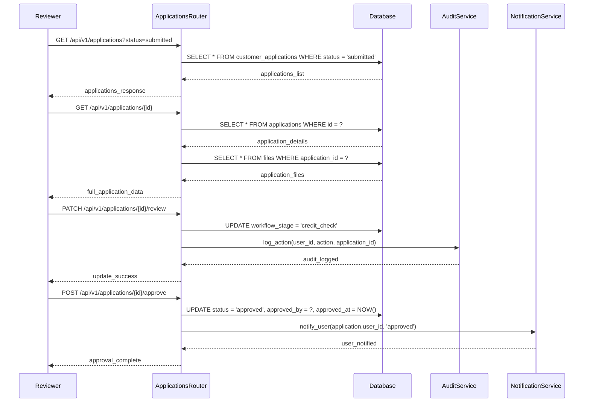

## 4. File Download and Access

### Secure File Access Flow

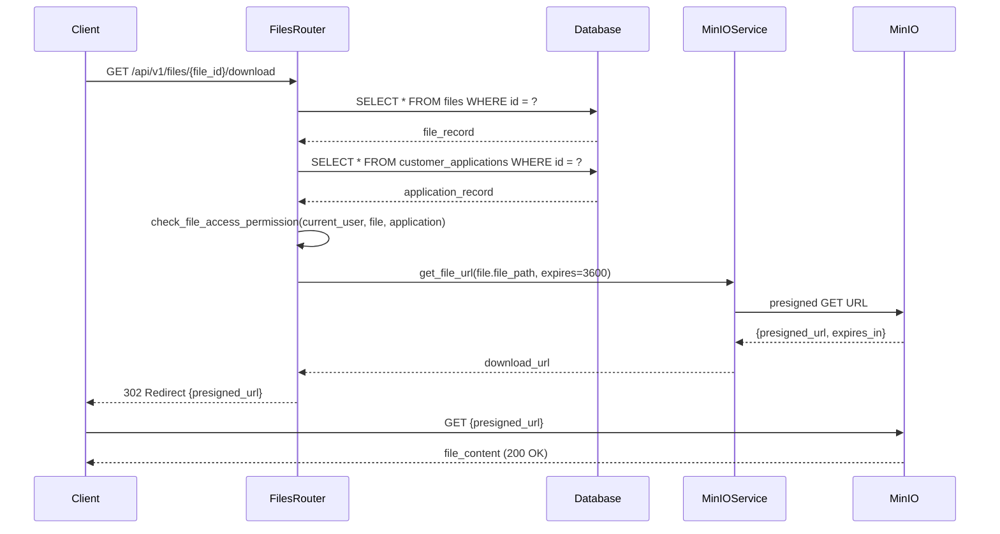

### Batch File Operations

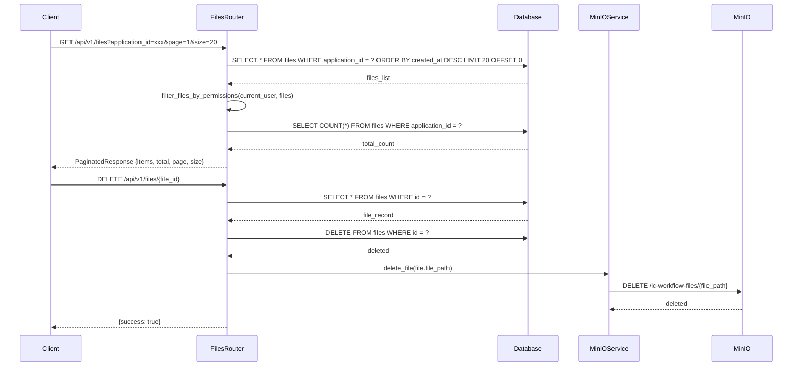

## 5. User Management Operations

### User Creation with Department/Branch Assignment

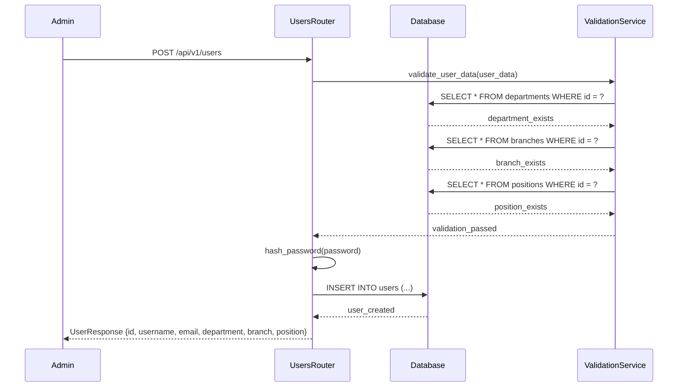

### User Update with Role Changes

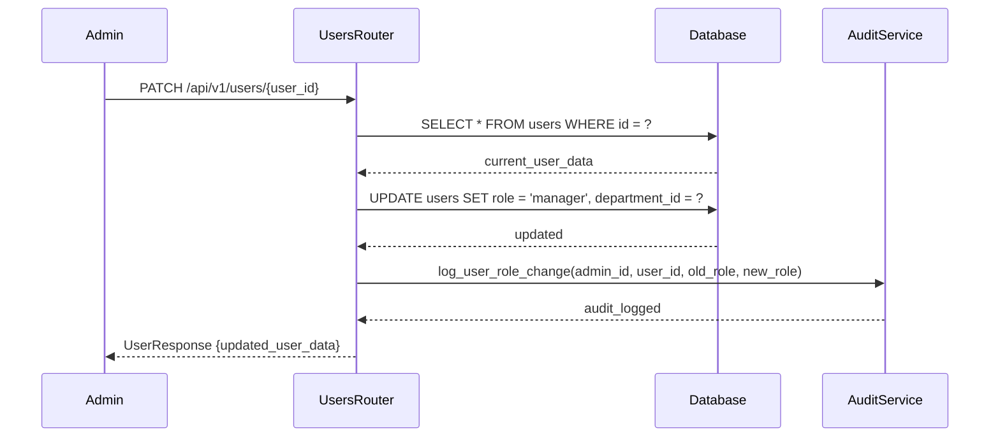

## 6. Error Handling and Recovery

### Database Connection Failure

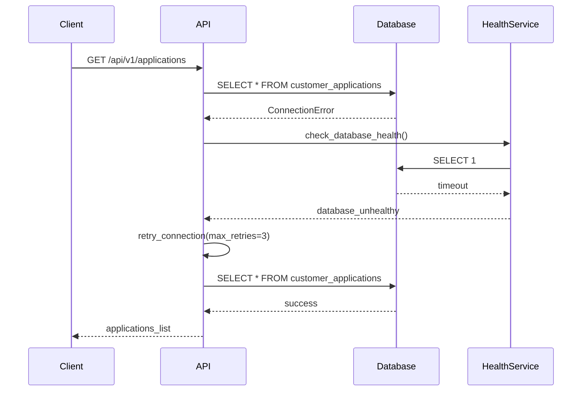

### MinIO Upload Failure Recovery

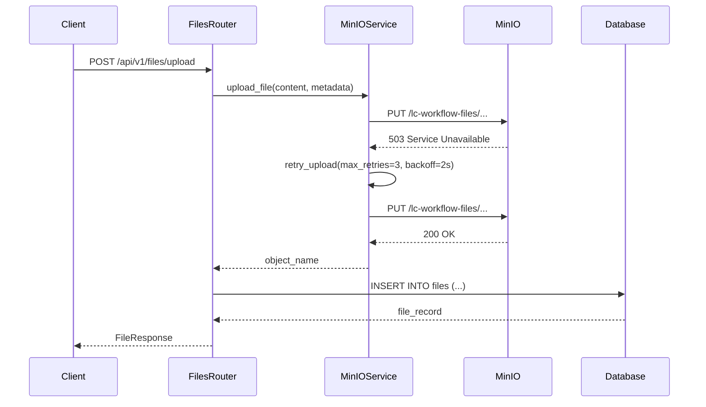

## 7. Batch Processing Workflows

### Bulk Application Status Update

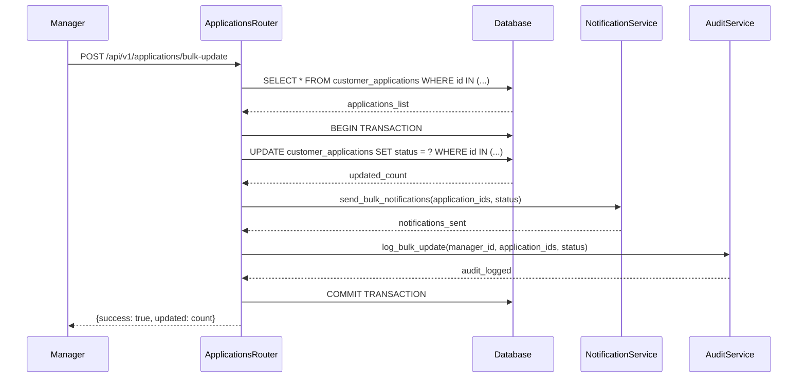

### Database Migration Workflow

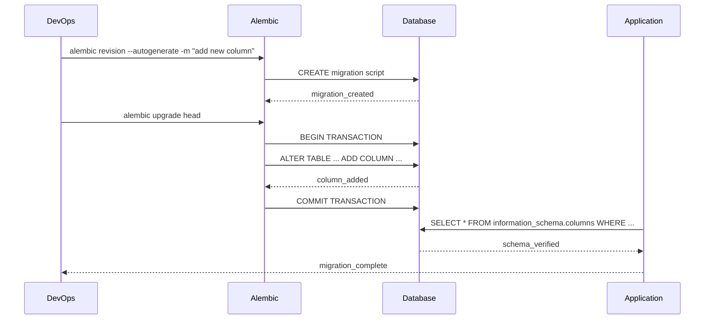

## 8. Real-time Updates (WebSocket)

### Application Status Change Notification

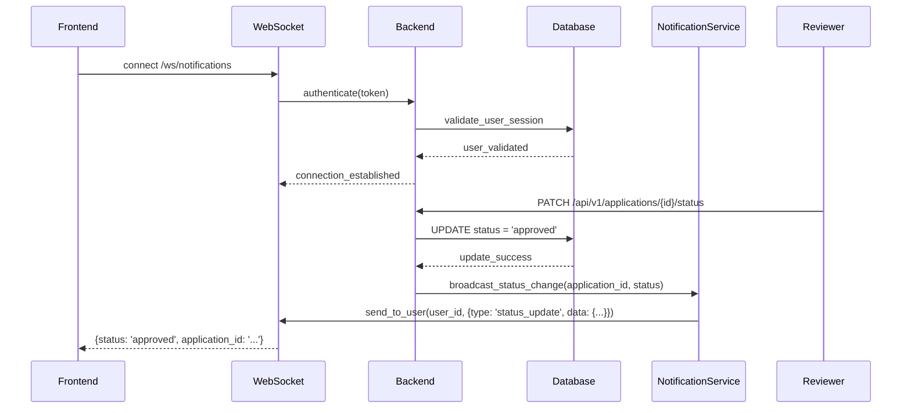

These sequence diagrams provide detailed insights into the backend flow, showing how data moves through the system, how services interact, and how errors are handled throughout the application lifecycle.